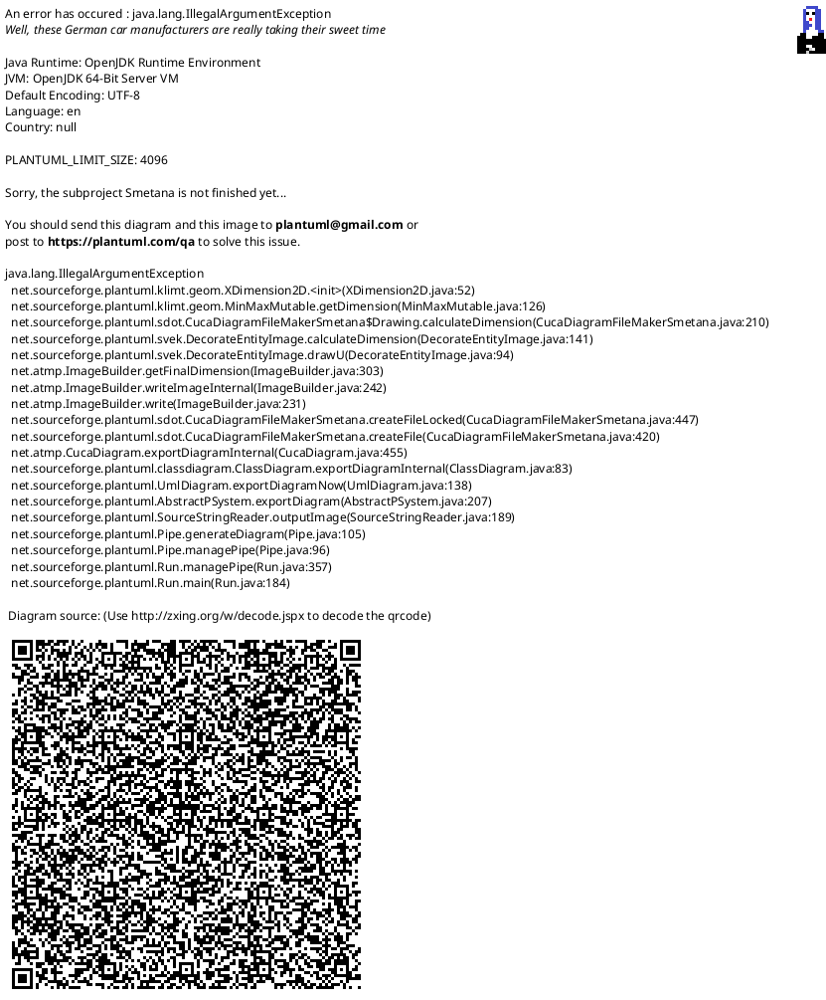

# The agent-control loop: compaction checkpoints, tiered delegation and lazy layers for OpenCode

This is a self-contained setup guide for the **agent-control** half of a long-session
OpenCode configuration: keeping the context alive across compaction, pushing heavy
steps to fresh-context subagents, and keeping the always-on startup prompt small. It
is one of two companion dumps. The other, *The requirements machine*, installs the
`REQUIREMENTS.md` registry, its coverage check and the idea process; applied
together, the two reproduce the combined `context-machine-setup` guide.

All files are stripped of the original project's specifics and given in an initial
empty state — the mechanisms work, domain data is empty. Paths: `~` = the user's home
directory (`C:\Users\<name>` on Windows), `<project>` = the root of your repository.

## 0. What the agent-control loop is and why it exists

The machine solves these problems of long agent sessions:

*   **Compaction amnesia.** When the context overflows, the summarizer model can output garbage (even a tool-call instead of a digest). Solution: warnings at 70%/85% of the limit + a mechanical checkpoint (verbatim human replicas + todo + touched files), which is always written regardless of the model, plus validation of the model's digest (`plugins/context-sentinel.ts`).
*   **Root context bloating.** Heavy steps are delegated to subagents with a fresh context; the root holds the vision (`plugins/delegate.ts` + `agents/*.md` + `DELEGATION MODE` protocol).
*   **Startup-context bloat.** Only a compact digest is always-on. Everything else is a lazy layer: area rules (a nested `AGENTS.md` auto-injected when a file under its path is read), task flows (`.opencode/skills/<name>/SKILL.md` — only name + description are always-on), and commands (`.opencode/command/<name>.md`, which force a skill load).
*   **Unmanageable costs/models.** Models are not hardcoded in agent files or tiers: selection is via `set_tier_model` with human approval; tiers = appetite for price/intelligence.

The fifth problem the original guide names, *knowledge drift*, is owned by the
companion requirements-machine dump — this dump only keeps the root `AGENTS.md`
digest and `STATE.md` checkpoint that the registry points into.

**Core principles:** fail-visible (never stay silent), mechanism not a request (contracts are held by gates and grammar, not by persuasion in the prompt), one truth per entity, verbatim (human instructions are not paraphrased), lazy by default (what is read at startup must not grow).

## 1. Complete file tree

```text
~/.config/opencode/                        # GLOBAL LOOP (OpenCode configuration)
 ├── opencode.jsonc                         # model, plugins, context cap, compaction, permissions
 ├── routing.json                           # providers + advisor (benchmark feed)
 ├── package.json                           # plugin dependencies + tests
 ├── README.md                              # runbook (how to kill what)
 ├── agents/
 │   ├── explore.md                         # subagent: read-only exploration
 │   ├── worker.md                          # subagent: coherent implementation step (MAIN)
 │   └── worker-lite.md                     # subagent: routine (LITE)
 ├── lib/
 │   └── advisor-core.ts                    # pure advisor helpers (NOT a plugin!)
 ├── plugins/
 │   ├── context-sentinel.ts                # compaction + mechanical checkpoint + warnings
 │   ├── delegate.ts                        # delegate_* / list_models / recommend_model / set_tier_model
 │   └── checkpoint-compaction.ts.disabled  # legacy plugin (absorbed by sentinel; do not enable)
 ├── templates/
 │   └── delegation-mode.md                 # MASTER COPY of the DELEGATION MODE section
 ├── skills/                                # LAZY LAYER: task flows
 │   └── <name>/SKILL.md                    # only name + description are always-on; body on invoke
 ├── command/                               # LAZY LAYER: slash-commands
 │   └── <name>.md                          # thin trigger that forces a skill load ($ARGUMENTS)
 └── tests/
     ├── advisor.test.mjs
     └── context-sentinel.test.mjs

<project>/                                 # PROJECT LOOP (repository)
 ├── AGENTS.md                              # agent startup digest (loaded every start)
 ├── REQUIREMENTS.md                        # ◁ companion dump (requirements machine)
 ├── STATE.md                               # checkpoint "what we are doing now" (untracked)
 ├── .gitignore
 ├── package.json                           # scripts: test, req, contract, state:diet, workflow-arrows:lint
 ├── .opencode/                             # LAZY LAYERS (tracked) + ephemeral checkpoints (ignored)
 │   ├── .gitignore                         # ignores node_modules/package.json/…; skills & commands stay tracked
 │   ├── skills/<name>/SKILL.md             # task flows (only the catalog is always-on)
 │   ├── command/<name>.md                  # slash-command → skill load
 │   └── CHECKPOINT-*.md                    # ephemeral compaction checkpoints (gitignored)
 ├── packages/<pkg>/AGENTS.md               # optional AREA RULES: auto-injected on read under that path
 ├── scripts/
 │   ├── req-coverage.js                    # ◁ companion dump (requirements machine)
 │   ├── state-diet.mjs                     # STATE.md diet (chronicle → archive)
 │   ├── workflow-arrows-lint.mjs           # flow map linter (drift → exit 1)
 │   └── contract.mjs                       # build the code map from module contract-headers
 ├── AGENTS/                                # add-ons, read ON DEMAND
 │   ├── README.md                          # pointer-digest
 │   ├── code-map.md                        # code map (generated; skeleton here)
 │   ├── workflow-arrows.md                 # flow map: how to read/lint/render
 │   ├── delegation-mode.md                 # copy of the master section (enabled by human phrase)
 │   ├── context-machine.md                 # WHY the context is structured this way
 │   ├── requirements.md                    # ◁ companion dump (requirements machine)
 │   ├── tools.md                           # dev-tools protocols
 │   └── domain-model.md                    # terminology dictionary (two layers)
 └── docs/
     ├── workflow-arrows.puml               # machine-readable flow map (empty at start)
     ├── ideas/                              # ◁ companion dump (requirements machine)
     │   ├── README.md                      # idea lifecycle
     │   └── idea-TEMPLATE.md               # brainstorm dump template
     └── history/
         └── state.md                       # STATE.md archive (empty at start)
```
Three lazy layers keep the always-on digest small: **area rules** (a nested `AGENTS.md`,
auto-injected on `read` under its path), **task flows** (`SKILL.md` — always-on is only
name + description), and **commands** (`command/<name>.md`, a thin trigger). The project
`.opencode/` holds the tracked lazy layers plus the sentinel's ephemeral checkpoints
(`CHECKPOINT-*.md`, gitignored).

## 2. Installation order

1. Create the global loop (§3) in `~/.config/opencode/`, run `npm install`, run `npm test` (both tests green).
2. Restart OpenCode. Ensure plugins loaded (sentinel writes to log `context-sentinel v… loaded`; `delegate_*`, `list_models`, `recommend_model`, `set_tier_model` are available in root).
3. Create the agent-control project files (§4) in `<project>/`.
4. Fill in the `<...>` placeholders in `opencode.jsonc` and `routing.json` with your provider/models (how to check models — runbook §5).
5. (Optional) Seed the lazy layers: `.opencode/skills/<name>/SKILL.md` for a task flow and `.opencode/command/<name>.md` to force-load it (see §3.15); a nested `packages/<pkg>/AGENTS.md` for area rules.
6. Apply the companion requirements-machine dump — the `REQUIREMENTS.md` registry, `scripts/req-coverage.js`, `AGENTS/requirements.md` and the `docs/ideas/` process.
7. Run the smoke test (§5).

## 3. GLOBAL LOOP — `~/.config/opencode/`

### 3.1 `~/.config/opencode/package.json`

```json
{
  "type": "module",
  "scripts": {
    "test": "node --test"
  },
  "dependencies": {
    "@opencode-ai/plugin": "1.14.19"
  }
}
```
Tests import `.ts` directly — requires Node ≥ 22.6 (type stripping) or bun.

### 3.2 `~/.config/opencode/opencode.jsonc`

```jsonc
{
   "$schema": "https://opencode.ai/config.json",
   // Main model for the root session. REPLACE with your verified model.
   "model": "<provider>/<root-model>",
   // Cheap model for generating titles/summaries (token savings).
   // Must be verified by a real call: "listed in catalog" ≠ "authorized".
   "small_model": "<provider>/<cheap-model>",
   "plugin": [
     "./plugins/context-sentinel.ts",
     // primary-only tools: delegation with model selection + model catalog
     "./plugins/delegate.ts"
   ],
   // Effective context budget for the root model.
   // Even if the model supports 1M, cut it to the boundary where quality/latency/price
   // start to degrade (usually 200–250k), so compaction happens where
   // it is still high quality. output < context, so the compaction reserve doesn't exceed the window.
   "provider": {
     "<provider>": {
       "models": {
         "<root-model>": {
           "limit": { "context": 250000, "output": 64000 }
         }
       }
     }
   },
   // The last ~30k tokens of the dialogue survive compaction verbatim
   // (protection of exact human instructions) + reserve for the compaction itself.
   "compaction": {
     "auto": true,
     "reserved": 16000,
     "preserve_recent_tokens": 30000
   },
   // Delegation tools — only for the root orchestrator;
   // subagents are denied them.
   "experimental": {
     "primary_tools": [
       "delegate_simple_task",
       "delegate_standard_task",
       "delegate_advanced_task",
       "list_models",
       "recommend_model",
       "set_tier_model"
     ]
   },
   // Money gate, by tiers. Permission in OpenCode is keyed by TOOL NAME,
   // hence one tool per tier. A child always starts with a fresh context
   // (prompt-cache miss) → EVERY delegation costs tokens → by default all are "ask".
   // The user can set any tier to "allow" (accept forever).
   "permission": {
     "delegate_simple_task": "ask",
     "delegate_standard_task": "ask",
     "delegate_advanced_task": "ask",
     "set_tier_model": "ask"
   }
 }
```

### 3.3 `~/.config/opencode/routing.json`

```json
{
  "providers": ["<provider>"],
  "advisor": {
    "enabled": true,
    "reportUrl": "https://krivich.github.io/opencode-benchmark/report.json",
    "ttlHours": 24,
    "maxRows": 40
  }
}
```
`providers` — catalog filter for `list_models`. `advisor` — daily benchmark feed: it DOES NOT choose a model and calculates nothing — it only draws a table (model, score, $/session, sessions/mo) along with the baseline (current root model); the root LLM weighs price and intelligence itself and proposes one model for human approval. Feed unavailable/not needed — `"enabled": false` (table degrades to `list_models` hint).

### 3.4 `~/.config/opencode/agents/explore.md`

```markdown
---
description: Fast codebase exploration and research (read-only). Use for reading files, searching, and gathering context so the main session saves its token budget.
mode: subagent
temperature: 0.1
steps: 15
permission:
  edit: deny
  write: deny
---
You are a read-only codebase explorer. Your job: find files, read them, search content, and report findings to the parent agent.

Rules:
- NEVER modify files. Research only.
- Read files in large chunks (2000 lines) instead of tiny slices – fewer requests = more budget.
- Batch independent tool calls in parallel.
- NEVER dump entire files into your report. Return compact findings:
  - file paths with line numbers (`src/foo.ts:42`)
  - 2-5 line code snippets only where essential
  - short structured summaries
- If the task is broad, state what you found AND what you did not find – the parent must not re-search after you.
- Budget discipline: your context window is 1M. Prefer targeted searches over exhaustive reads.

<!-- managed config: ~/.config/opencode/agents/explore.md (runbook: ~/.config/opencode/README.md §Workers) | disable: mv explore.md{,.disabled} + restart | created <date> -->
```

### 3.5 `~/.config/opencode/agents/worker.md`

```markdown
---
description: Isolated worker, MAIN tier – implementation of one coherent step. Model inherits primary (or set via delegate). Contract is entirely in the brief from the root.
mode: subagent
temperature: 0.2
steps: 80
permission:
  edit: allow
---
Do the task described in the user message. The message is a complete brief: context, contract, report format. If the brief lacks information required to start, return a report with a blocker instead of guessing.

<!-- managed config: ~/.config/opencode/agents/worker.md (runbook: ~/.config/opencode/README.md §Workers) | disable: mv worker.md{,.disabled} + restart | created <date> -->
```

### 3.6 `~/.config/opencode/agents/worker-lite.md`

```markdown
---
description: Isolated worker, LITE tier – routine, search, simple edits. Model inherits primary or set via delegate/tier=cheap. Contract is entirely in the brief from the root.
mode: subagent
temperature: 0.2
steps: 80
permission:
  edit: allow
---
Do the task described in the user message. The message is a complete brief: context, contract, report format. If the brief lacks information required to start, return a report with a blocker instead of guessing.

<!-- managed config: ~/.config/opencode/agents/worker-lite.md (runbook: ~/.config/opencode/README.md §Workers) | disable: mv worker-lite.md{,.disabled} + restart | created <date> -->
```
**Important:** there is NO `model` field in agent files — the model is chosen on call via delegate tools. Hardcoding a model breaks silently when the model is revoked/banned.

### 3.7 `~/.config/opencode/lib/advisor-core.ts`

Lives in `lib/`, not in `plugins/`: OpenCode treats EVERY exported function of a module in `plugin[]` as a plugin factory — helpers in a plugin file would crash startup.

```typescript
/**
 * advisor-core – pure helpers for the delegate plugin.
 *
 * IMPORTANT: this file lives in `~/.config/opencode/lib/`, NOT in `plugins/`.
 * opencode treats EVERY exported function of a module listed in `plugin[]` as a
 * plugin factory (it calls it with PluginInput). Putting helpers in the plugin file
 * crashed startup, so they live in a non-plugin module.
 *
 * PHILOSOPHY
 * The advisor does NOT compute a "best" model and applies NO formula/threshold. It
 * fetches the daily benchmark feed and renders a plain table: model, benchmark score
 * ("parrots"), price per session, sessions/month. The root LLM reads the table plus
 * the user's request, weighs price vs intelligence itself (and its own knowledge of
 * these models), and proposes one model for human approval. Benchmark units are
 * arbitrary and may change over time, so normalizing them is meaningless.
 */

export const DEFAULT_ADVISOR = {
  enabled: true,
  reportUrl: "https://krivich.github.io/opencode-benchmark/report.json",
  ttlHours: 24,
  maxRows: 40,
}

export type Advisor = typeof DEFAULT_ADVISOR

// ── tiers ────────────────────────────────────────────────────────────────────────
// A tier is only a hint about the price/intelligence appetite. It carries no model.
// Each tier maps 1:1 to its own delegate tool, so the user can set a different
// permission / auto-approve per tier:
//   simple    – lean cheap; uses an approved model (its own tool)
//   standard  – inherit the root model (no model choice; still costs tokens)
//   advanced  – allow paying for real intelligence; uses an approved model
export const TIERS = ["simple", "standard", "advanced"] as const
export type Tier = (typeof TIERS)[number]

/** Map an arbitrary value to a known tier ("low" is an alias of "simple"); unknown → "standard". */
export function tierOf(v: unknown): Tier {
  const s = String(v ?? "").trim().toLowerCase()
  if (s === "low" || s === "simple") return "simple"
  if (s === "advanced") return "advanced"
  return "standard"
}

// ── feed row helpers ─────────────────────────────────────────────────────────────

/** Lowercase, strip parentheticals ("(Off-Peak)", "(≤ 256K tokens)"), slugify. */
export function normalizeName(s: unknown): string {
  return String(s ?? "")
    .toLowerCase()
    .replace(/\([^)]*\)/g, " ")
    .replace(/[^a-z0-9.]+/g, "-")
    .replace(/^-+|-+$/g, "")
    .replace(/-{2,}/g, "-")
}

export function variantOf(name: unknown): "peak" | "off" | null {
  const s = String(name ?? "")
  if (/off[\s-]?peak/i.test(s)) return "off"
  if (/\bpeak\b/i.test(s)) return "peak"
  return null
}

/** Peak windows are [fromHour,fromMinute,toHour,toMinute] in `tz` (UTC so far). */
export function isPeakNow(peakHours: any, now: Date): boolean {
  if (!peakHours || !Array.isArray(peakHours.ranges) || !peakHours.ranges.length) return false
  const day = now.getUTCDay()
  if (Array.isArray(peakHours.days) && peakHours.days.length === 2) {
    const [from, to] = peakHours.days
    if (typeof from === "number" && typeof to === "number" && (day < from || day > to)) return false
  }
  const m = now.getUTCHours() * 60 + now.getUTCMinutes()
  return peakHours.ranges.some((r: number[]) => {
    if (!Array.isArray(r) || r.length < 4) return false
    const a = r[0] * 60 + r[1]
    const b = r[2] * 60 + r[3]
    return a <= b ? m >= a && m < b : m >= a || m < b
  })
}

/** Feed rows for one model id may carry Peak/Off-Peak variants; pick the live one. */
export function effectiveRow(rows: any[], now: Date): any {
  if (!rows || !rows.length) return null
  if (rows.length === 1) return rows[0]
  const ph = rows.find((r) => r && r.peakHours)?.peakHours
  const want = isPeakNow(ph, now) ? "peak" : "off"
  const match = rows.find((r) => variantOf(r.model) === want)
  if (match) return match
  return rows
    .slice()
    .sort((a, b) => (a?.mpPerSession ?? Infinity) - (b?.mpPerSession ?? Infinity))[0]
}

/**
 * Map a feed row to a live catalog ref.
 * Prefers a real `modelId` (+ `provider`) when the feed provides it; otherwise
 * normalizes the display name and matches against the catalog.
 */
export function mapRowToRef(row: any, catalog: string[], providers: string[]): string | null {
  if (row && typeof row.modelId === "string" && row.modelId) {
    const direct = typeof row.provider === "string" && row.provider ? `${row.provider}/${row.modelId}` : row.modelId
    if (catalog.includes(direct)) return direct
    const hit = catalog.find((r) => r.slice(r.indexOf("/") + 1) === row.modelId)
    if (hit) return hit
  }
  const norm = normalizeName(row?.model)
  if (!norm) return null
  const hits = catalog.filter((r) => normalizeName(r.slice(r.indexOf("/") + 1)) === norm)
  if (hits.length === 1) return hits[0]
  if (hits.length > 1) {
    return hits.find((h) => providers.includes(h.slice(0, h.indexOf("/")))) ?? hits[0]
  }
  return null
}

// ── plain table (no ranking, no formula) ─────────────────────────────────────────

export type ModelRow = {
  ref: string
  name: string
  score: number | null
  /** True when the feed scored this model — only measured rows can be weighed on intelligence. */
  measured: boolean
  usdPerSession: number | null
  mpPerSession: number | null
  quotaUsd: number | null
  sessionsPerMonth: number | null
  variant: string | null
  /** True for the root/primary model — the baseline tier=standard inherits. */
  root: boolean
}

export type ModelTable = {
  rows: ModelRow[]
  report: { generatedAt?: string; ageHours: number; stale: boolean; measured: number; total: number } | null
  reason?: string
}

/** Build the raw table for every live catalog model the feed knows about. */
export function modelTable(args: {
  report: any
  fetchedAt: number
  stale: boolean
  catalog: string[]
  dead: Set<string>
  providers: string[]
  maxRows?: number
  rootRef?: string | null
}): ModelTable {
  const { report, fetchedAt, stale, catalog, dead, providers, maxRows, rootRef } = args
  if (!report || !Array.isArray(report.rows)) return { rows: [], report: null, reason: "no report" }

  const now = new Date()
  const groups = new Map<string, any[]>()
  for (const row of report.rows) {
    const ref = mapRowToRef(row, catalog, providers)
    if (!ref || dead.has(ref)) continue
    const g = groups.get(ref) ?? []
    g.push(row)
    groups.set(ref, g)
  }

  const rows: ModelRow[] = []
  for (const [ref, list] of groups) {
    const row = effectiveRow(list, now)
    rows.push({
      ref,
      name: row?.model ?? ref,
      score: typeof row?.score === "number" ? row.score : null,
      measured: typeof row?.score === "number",
      usdPerSession: typeof row?.priceUsdPerSession === "number" ? row.priceUsdPerSession : null,
      mpPerSession: typeof row?.mpPerSession === "number" ? row.mpPerSession : null,
      quotaUsd: typeof row?.quotaUsd === "number" ? row.quotaUsd : null,
      sessionsPerMonth: typeof row?.requestsPerMonth === "number" ? row.requestsPerMonth : null,
      variant: variantOf(row?.model),
      root: !!rootRef && ref === rootRef,
    })
  }
  // Presentation order only (NOT a ranking/score): models the feed measured come
  // first so a score-less ultra-cheap row cannot be grabbed by mistake; within each
  // group, cheapest first.
  rows.sort(
    (a, b) =>
      (a.measured ? 0 : 1) - (b.measured ? 0 : 1) ||
      (a.mpPerSession ?? Infinity) - (b.mpPerSession ?? Infinity) ||
      a.ref.localeCompare(b.ref),
  )

  const measured = rows.filter((r) => r.score != null).length
  const shown = Number.isFinite(maxRows) && (maxRows as number) > 0 ? rows.slice(0, maxRows as number) : rows
  const ageHours = fetchedAt ? (Date.now() - fetchedAt) / 3.6e6 : 0

  return {
    rows: shown,
    report: { generatedAt: report.generatedAt, ageHours, stale, measured, total: rows.length },
  }
}

export function usd(v: number | null): string {
  return v == null ? "?" : `$${v.toFixed(5)}`
}

/** One compact line for a model: score, price, sessions/month. */
export function modelSummary(r: ModelRow): string {
  return `${r.ref} — score ${r.score ?? "—"}, ${usd(r.usdPerSession)}/session, ${r.sessionsPerMonth ?? "—"} sessions/mo`
}

/**
 * Top MEASURED alternatives (score present), cheapest first, excluding one ref.
 * Used to surface the overview inside the `set_tier_model` permission prompt, so
 * the human can weigh a pin against the same data the advisor table shows.
 */
export function alternativesDigest(table: ModelTable, excludeRef?: string, limit = 6): string[] {
  const out: string[] = []
  for (const r of table.rows) {
    if (!r.measured) continue
    if (excludeRef && r.ref === excludeRef) continue
    out.push(modelSummary(r))
    if (out.length >= limit) break
  }
  return out
}

function renderTable(rows: ModelRow[], rootRef?: string | null): string[] {
  const lines: string[] = ["  #  model                             score  $/session   sessions/mo  peak"]
  rows.forEach((x, i) => {
    const ref = (x.ref.length > 32 ? x.ref.slice(0, 31) + "…" : x.ref).padEnd(32)
    const score = (x.score == null ? "—" : String(x.score)).padStart(5)
    const price = usd(x.usdPerSession).padStart(10)
    const spm = (x.sessionsPerMonth == null ? "—" : String(x.sessionsPerMonth)).padStart(11)
    const mark = x.root ? "  ← your model (standard)" : ""
    lines.push(`  ${String(i + 1).padStart(2)}  ${ref} ${score} ${price}  ${spm}  ${x.variant ?? ""}${mark}`)
  })
  return lines
}

/** Human-readable table + an explicit instruction to decide, not to trust a formula. */
export function tableText(table: ModelTable, tier: Tier, rootRef?: string | null): string {
  const lines: string[] = [
    `MODEL OPTIONS — tier=${tier}. Raw benchmark/price data to weigh against your baseline — not a recommendation and not a ranking. No child was started; nothing was spent yet.`,
  ]

  if (rootRef) {
    const b = table.rows.find((r) => r.ref === rootRef)
    if (b) {
      lines.push(`Baseline (tier=standard = your current model): ${modelSummary(b)}.`)
    } else {
      lines.push(`Baseline (tier=standard = your current model): ${rootRef} (not in the feed table).`)
    }
  }

  if (!table.report) {
    lines.push(`Advisor feed unavailable (${table.reason ?? "offline"}, no cache).`)
    lines.push("Fallback: use list_models for the live catalog and your own knowledge, then set_tier_model.")
  } else {
    const r = table.report
    const age = r.ageHours < 1 ? `${Math.round(r.ageHours * 60)}min` : `${r.ageHours.toFixed(1)}h`
    lines.push(
      `Feed: ${r.generatedAt ?? "?"} (${r.stale ? "STALE" : "fresh"}, ${age} old) — ${r.measured}/${r.total} catalog models measured.`,
    )
    lines.push("")

    const measured = table.rows.filter((x) => x.measured)
    const unmeasured = table.rows.filter((x) => !x.measured)

    if (measured.length) {
      lines.push("MEASURED (has a benchmark score) — candidates to weigh on intelligence vs price, cheapest first:")
      lines.push(...renderTable(measured, rootRef))
    } else {
      lines.push(
        "MEASURED: none — the feed scored no live catalog model, so intelligence cannot be weighed here; decide from your own knowledge.",
      )
    }

    if (unmeasured.length) {
      lines.push("")
      lines.push(
        "NO BENCHMARK (score —, intelligence UNKNOWN) — reference only; do NOT propose one of these as the tier representative:",
      )
      lines.push(...renderTable(unmeasured, rootRef))
    }

    lines.push("")
    lines.push(
      'score = benchmark "final" in its own arbitrary units (higher = smarter as measured; NOT comparable across time or versions). $/session = cost of one typical session. sessions/mo = how many such sessions fit the monthly pool.',
    )
  }

  lines.push("")
  lines.push(
    "Tier intent — RELATIVE to the baseline above: simple → cheaper/weaker than your model is fine; advanced → smarter/pricier is worth it; standard → inherit your model (no model choice; still costs tokens).",
  )
  lines.push("")
  lines.push("Root — decide, do not look for a formula:")
  lines.push("  1. Read the user's request and the conversation; judge whether cheap-but-decent or expensive-and-smart fits.")
  lines.push("  2. Compare candidates to the baseline and weigh the table AND your own knowledge of these models. Treat the score as a rough, aging hint, not truth.")
  lines.push("  3. Prefer a MEASURED row. A score-less model cannot be weighed on intelligence — pick one only with an explicit non-benchmark reason, and state it.")
  lines.push("  4. Show this table to the user and propose ONE concrete model; get agreement (the user may name any other model).")
  lines.push(
    `  5. Call set_tier_model({ tier: "${tier}", model, note }) — the native permission prompt lists the top measured alternatives. On approval the model is pinned for this session (24h).`,
  )
  lines.push("  6. Re-run delegate with the same brief and tier; it will then execute.")
  return lines.join("\n")
}
```

### 3.8 `~/.config/opencode/plugins/context-sentinel.ts`

```typescript
/**
 * context-sentinel – plugin for OpenCode
 *
 * WHAT IT DOES
 * 1. Tracks current context size (prompt tokens of the last assistant message)
 *    and warns via TUI toast when approaching the model's context limit,
 *    so a manual checkpoint + /compact can be done BEFORE auto-compaction.
 * 2. Replaces the default compaction prompt with a structured checkpoint-style
 *    prompt, AND writes a MECHANICAL checkpoint file (verbatim last user posts +
 *    todo + touched files) that does NOT depend on the compaction model producing
 *    anything useful. The path is injected into the compaction context so the next
 *    turn knows to read it.
 * 3. Validates the model's compaction digest (rejects empty / tool-call output) and
 *    falls back to the mechanical checkpoint; logs every step (no more silent fails).
 * 4. Signs files created by the agent whose name matches SENTINEL_SIGN patterns
 *    (default: CHECKPOINT*,*.checkpoint.md).
 *
 * RECOVERY / RUNBOOK
 * Full runbook lives in ~/.config/opencode/README.md.
 * Quick kill-switch (restores stock opencode behavior):
 *   mv ~/.config/opencode/plugins/context-sentinel.ts{,.disabled} && restart opencode
 */

/*
 * CONFIG SOURCES (no hardcoded models!)
 * - Context limits are resolved at runtime, in order:
 *     1. live /config/providers endpoint (client.config.providers())
 *     2. client.config.get()
 *     3. JSONC parse of ~/.config/opencode/opencode.json(c) and <project>/opencode.json(c)
 *     4. conservative fallback DEFAULT_LIMIT (warns early, never late)
 * - Thresholds: SENTINEL_WARN (default 0.7), SENTINEL_CRIT (default 0.85)
 * - Signed file patterns: SENTINEL_SIGN (default "CHECKPOINT*,*.checkpoint.md")
 * - Checkpoint: SENTINEL_CHECKPOINT_DIR (default ".opencode"),
 *   SENTINEL_KEEP_USER (default 12 verbatim user posts),
 *   SENTINEL_MIN_DIGEST (default 200 chars to accept a model digest)
 */

import type { Plugin } from "@opencode-ai/plugin"
import { basename, isAbsolute, join } from "node:path"
import { homedir } from "node:os"
import { appendFileSync, existsSync, mkdirSync, readFileSync, writeFileSync } from "node:fs"
import { readFile, stat } from "node:fs/promises"

const VERSION = "1.5.0"
const DEFAULT_LIMIT = 128_000
const SIGN_MARK = "autograph: created by context-sentinel"

const envFrac = (name: string, fallback: number) => {
  const n = Number(process.env[name])
  return Number.isFinite(n) && n > 0 && n < 1 ? n : fallback
}
const envInt = (name: string, fallback: number) => {
  const n = Number(process.env[name])
  return Number.isFinite(n) && n > 0 ? Math.floor(n) : fallback
}

const WARN_LEVEL = envFrac("SENTINEL_WARN", 0.7)
const CRIT_LEVEL = envFrac("SENTINEL_CRIT", 0.85)
const KEEP_USER = envInt("SENTINEL_KEEP_USER", 12)
const MIN_DIGEST = envInt("SENTINEL_MIN_DIGEST", 200)
const CHECKPOINT_DIR = process.env.SENTINEL_CHECKPOINT_DIR ?? ".opencode"

const SIGN_PATTERNS = (process.env.SENTINEL_SIGN ?? "CHECKPOINT*,*.checkpoint.md")
  .split(",")
  .map((s) => s.trim())
  .filter(Boolean)

const wildcardRegex = (pattern: string) =>
  new RegExp(
    "^" + pattern.split("*").map((s) => s.replace(/[.*+?^${}()|[\]\\]/g, "\\$&")).join(".*") + "$",
    "i",
  )

const SIGN_RES = SIGN_PATTERNS.map(wildcardRegex)

const signatureHeader = () =>
  `<!-- ${SIGN_MARK} v${VERSION} | plugin: ~/.config/opencode/plugins/context-sentinel.ts | file is safe to delete anytime; to disable the mechanism: mv context-sentinel.ts{,.disabled} + restart opencode -->\n\n`

const COMPACTION_PROMPT = `You are generating a compaction summary that will REPLACE the conversation history.
The continuation of work depends entirely on the quality of this summary. Be precise and dense.

Produce a structured checkpoint in this exact format:

## TASK
What the user asked for, verbatim intent (1-3 sentences).

## USER INSTRUCTIONS (verbatim)
The user's own instructions, requirements, constraints and preferences from this session,
AS CLOSE TO THE ORIGINAL WORDING AS POSSIBLE. Do not paraphrase. This is the highest-priority
content, because it cannot be reconstructed later. Include EVERY standing order the user gave.

## STATUS
What is DONE. What is IN PROGRESS right now. What is NOT started.

## KEY FACTS & DECISIONS
- Critical facts discovered (file paths, line numbers, API contracts, config values, error messages)
- Decisions made and WHY (rejected alternatives matter – do not re-explore them)

## ALREADY ESTABLISHED (DO NOT RE-EXPLORE)
- Concrete facts already learned (paths, symbols, architecture, findings). The next session must
  trust this list and MUST NOT re-investigate these areas unless something contradicts it.

## FILES TOUCHED
- path – what was done/learned there (with line refs where relevant)

## NEXT STEPS
- Numbered, concrete, executable steps. The next step must be startable without any clarification.

## CHECKPOINTS & DOCS
- If CHECKPOINT*.md, JOURNAL.md, STAGE.md or similar project files exist and are relevant, list them –
  the next session MUST read them before acting.

Rules:
- Output ONLY the checkpoint text (Markdown). Do NOT call tools, do NOT ask questions, do NOT read files,
  do NOT run commands. Tools are UNAVAILABLE in this mode.
- Never emit tool-call syntax of any kind; your ENTIRE reply must be the checkpoint text.
- Include exact identifiers, paths, commands – never vague references like "the file we discussed".
- Omit small talk and tool-call noise. Keep only what changes future behavior.
- Write in the language of the original conversation.`

type WarnLevel = "none" | "warn" | "crit"

const TOOL_CALL_RE =
  /<tool[_\s-]?calls?>|<\|tool|<\/?invoke\b|"tool"\s*:|\bRunning tool\b|^\s*\{\s*"name"\s*:/im

/** A digest is usable only if it is real prose, not an empty string or a tool call. */
const looksLikeToolCall = (s: string) => TOOL_CALL_RE.test(s)
const validateDigest = (s: string) => {
  const t = (s ?? "").trim()
  return t.length >= MIN_DIGEST && !looksLikeToolCall(t)
}

/** Strip // and block comments plus trailing commas from JSONC, string-safe. */
function stripJsonc(src: string): string {
  let out = ""
  let inStr = false
  let esc = false
  for (let i = 0; i < src.length; i++) {
    const c = src[i]!
    const next = src[i + 1]
    if (inStr) {
      out += c
      if (esc) esc = false
      else if (c === "\\") esc = true
      else if (c === '"') inStr = false
      continue
    }
    if (c === '"') {
      inStr = true
      out += c
      continue
    }
    if (c === "/" && next === "/") {
      while (i < src.length && src[i] !== "\n") i++
      out += "\n"
      continue
    }
    if (c === "/" && next === "*") {
      i += 2
      while (i < src.length && !(src[i] === "*" && src[i + 1] === "/")) i++
      i++
      continue
    }
    out += c
  }
  return out.replace(/,(\s*[}\]])/g, "$1")
}

function addLimit(out: Map<string, number>, id: unknown, ctx: unknown) {
  if (
    typeof id === "string" &&
    id &&
    typeof ctx === "number" &&
    Number.isFinite(ctx) &&
    ctx > 0 &&
    !out.has(id)
  ) {
    out.set(id, ctx)
  }
}

/**
 * Accepts two shapes:
 *  - config files / client.config.get(): { provider: { <pid>: { models: { <id>: { limit: { context } } } } } }
 *  - client.config.providers():           { providers: [ { models: { <id>: { limit: { context } } } } ] }
 */
function collectLimits(cfg: unknown, out: Map<string, number>) {
  const providers = (cfg as any)?.provider
  if (providers && typeof providers === "object" && !Array.isArray(providers)) {
    for (const p of Object.values<any>(providers)) {
      const models = p?.models
      if (!models || typeof models !== "object") continue
      for (const [id, m] of Object.entries<any>(models)) addLimit(out, id, m?.limit?.context)
    }
  }
  const list = (cfg as any)?.providers
  if (Array.isArray(list)) {
    for (const p of list) {
      const models = p?.models
      if (!models || typeof models !== "object") continue
      for (const [id, m] of Object.entries<any>(models)) addLimit(out, id, m?.limit?.context)
    }
  }
}

export const ContextSentinel: Plugin = async ({ client, directory }) => {
  // session ids that belong to subagents (have a parent) – their context and
  // compaction must not drive root warnings or pollute the checkpoint files.
  const childSessions = new Set<string>()
  // sessionID -> checkpoint file written by the compacting hook (for the event/autocontinue).
  const checkpoints = new Map<string, string>()
  let lastLevel: WarnLevel = "none"
  let lastKnownContext = 0
  let limitsPromise: Promise<Map<string, number>> | undefined

  const projectDir = directory && isAbsolute(directory) ? directory : process.cwd()

  const log = async (level: "info" | "warn" | "error", message: string) => {
    try {
      await client.app.log({ body: { service: "context-sentinel", level, message } })
    } catch {
      console.error(`[context-sentinel] ${message}`)
    }
  }

  await log(
    "info",
    `context-sentinel v${VERSION} loaded (warn=${WARN_LEVEL}, crit=${CRIT_LEVEL}, sign=${SIGN_PATTERNS.join(",")}, checkpointDir=${CHECKPOINT_DIR}, keepUser=${KEEP_USER})`,
  )

  const configCandidates = (): string[] => {
    const home = join(homedir(), ".config", "opencode")
    const candidates = [join(home, "opencode.json"), join(home, "opencode.jsonc")]
    if (directory && isAbsolute(directory)) {
      candidates.push(join(directory, "opencode.json"), join(directory, "opencode.jsonc"))
    }
    return candidates
  }

  const loadLimits = async (): Promise<Map<string, number>> => {
    const limits = new Map<string, number>()

    try {
      const res = await (client as any).config?.providers?.()
      const data = res?.data ?? res
      if (data && typeof data === "object") collectLimits(data, limits)
    } catch {
      // endpoint unavailable – fall through
    }

    if (limits.size === 0) {
      try {
        const cfg = await (client as any).config?.get?.()
        if (cfg && typeof cfg === "object") collectLimits(cfg, limits)
      } catch {
        // SDK not available – fall through to file reading
      }
    }

    for (const path of configCandidates()) {
      if (limits.size > 0) break
      try {
        await stat(path)
        const raw = await readFile(path, "utf8")
        const parsed = JSON.parse(stripJsonc(raw))
        collectLimits(parsed, limits)
      } catch {
        // missing or unparseable config – try next candidate
      }
    }
    return limits
  }

  const getLimits = () => (limitsPromise ??= loadLimits())

  const notify = async (
    message: string,
    variant: "info" | "success" | "warning" | "error" = "warning",
  ) => {
    const tui: any = (client as any).tui
    try {
      if (typeof tui?.showToast === "function") {
        await tui.showToast({ body: { message, variant } })
        return
      }
      if (typeof tui?.toast?.show === "function") {
        await tui.toast.show({ body: { message, variant } })
        return
      }
    } catch {
      // fall through to log
    }
    await log("warn", message)
  }

  const extractContextTokens = (info: any): number => {
    try {
      const t = info?.tokens
      if (!t) return 0
      const input = typeof t.input === "number" ? t.input : 0
      const read = typeof t.cache?.read === "number" ? t.cache.read : 0
      const write = typeof t.cache?.write === "number" ? t.cache.write : 0
      return input + read + write
    } catch {
      return 0
    }
  }

  const fetchMessages = async (sessionID: string): Promise<any[]> => {
    try {
      const res = await (client as any).session?.messages?.({ path: { id: sessionID } })
      const data = res?.data ?? res
      return Array.isArray(data) ? data : (data?.messages ?? [])
    } catch (e) {
      await log("warn", `messages fetch failed: ${e}`)
      return []
    }
  }

  const fetchTodos = async (sessionID: string): Promise<any[]> => {
    try {
      const res = await (client as any).session?.todo?.({ path: { id: sessionID } })
      const data = res?.data ?? res
      return Array.isArray(data) ? data : (data?.todos ?? [])
    } catch {
      return []
    }
  }

  const isCompactionCarrier = (t: string) => /^\[compaction\]/i.test(t.trim()) && t.trim().length < 60

  /** Mechanical, model-independent checkpoint: verbatim user posts + todo + touched files. */
  const buildMechanicalCheckpoint = async (
    sessionID: string,
  ): Promise<{ markdown: string; userCount: number; files: string[]; todos: number } | null> => {
    const list = await fetchMessages(sessionID)
    if (!list.length) return null

    const users: string[] = []
    const files = new Set<string>()
    for (const item of list) {
      const info = item?.info ?? item
      const parts: any[] = item?.parts ?? []
      if (info?.role === "user") {
        const text = parts
          .filter((p) => p?.type === "text")
          .map((p) => p?.text ?? "")
          .join("\n")
          .trim()
        if (text && !isCompactionCarrier(text)) users.push(text)
      }
      for (const p of parts) {
        if (p?.type !== "tool") continue
        const inp = p?.state?.input ?? p?.input
        const fp = inp?.filePath ?? inp?.path
        if (typeof fp === "string" && fp) files.add(fp)
      }
    }

    const lastUsers = users.slice(-KEEP_USER)
    const todos = await fetchTodos(sessionID)
    const stamp = new Date().toISOString()

    const md = [
      `# Mechanical checkpoint (${stamp})`,
      ``,
      `- session: ${sessionID}`,
      `- project: ${projectDir}`,
      `- user posts captured: ${lastUsers.length} (verbatim, newest last)`,
      ``,
      `## USER INSTRUCTIONS (verbatim — authoritative, do not paraphrase)`,
      ...lastUsers.map((t, i) => `\n### User post ${i + 1}\n\n${t}`),
      ``,
      `## TODO`,
      todos.length
        ? todos
            .map((t: any) => `- [${t?.status ?? "?"}] ${t?.content ?? t?.title ?? JSON.stringify(t)}`)
            .join("\n")
        : "(no todo list)",
      ``,
      `## FILES TOUCHED (from tool calls)`,
      files.size ? [...files].map((f) => `- ${f}`).join("\n") : "(none detected)",
      ``,
    ].join("\n")

    return { markdown: md, userCount: lastUsers.length, files: [...files], todos: todos.length }
  }

  const writeCheckpoint = (markdown: string): string | null => {
    try {
      const dir = join(projectDir, CHECKPOINT_DIR)
      mkdirSync(dir, { recursive: true })
      const stamp = new Date().toISOString().slice(0, 19).replace(/[:T]/g, "-")
      const file = join(dir, `CHECKPOINT-${stamp}.md`)
      writeFileSync(file, signatureHeader() + markdown)
      return file
    } catch (e) {
      void log("warn", `cannot write checkpoint file: ${e}`)
      return null
    }
  }

  /** Read the model's digest from the session and accept it only if it is real prose. */
  const readModelDigest = async (sessionID: string): Promise<string | null> => {
    const list = await fetchMessages(sessionID)
    for (let i = list.length - 1; i >= 0; i--) {
      const item = list[i]
      const info = item?.info ?? item
      const isSummary = info?.summary === true || info?.mode === "compaction"
      if (!isSummary) continue
      const text = (item.parts || [])
        .filter((p: any) => p?.type === "text")
        .map((p: any) => p?.text || "")
        .join("\n")
        .trim()
      if (validateDigest(text)) return text
      await log(
        "warn",
        `rejected compaction digest: ${text.length} chars${looksLikeToolCall(text) ? ", looks like a tool call" : text.length < MIN_DIGEST ? `, < ${MIN_DIGEST} chars minimum` : ""}`,
      )
    }
    return null
  }

  // Append the validated model digest to the mechanical checkpoint, if both exist.
  const appendDigest = (file: string, digest: string) => {
    try {
      appendFileSync(file, `\n## MODEL DIGEST (validated, ${digest.length} chars)\n\n${digest}\n`)
      void log("info", `digest appended to ${file}`)
    } catch (e) {
      void log("warn", `cannot append digest: ${e}`)
    }
  }

  // Best-effort legacy persistence into STATE.md when the project uses one.
  const persistToState = (text: string) => {
    const statePath = join(projectDir, "STATE.md")
    if (!existsSync(statePath)) return
    try {
      const stamp = new Date().toISOString().slice(0, 16).replace("T", " ")
      const block = `\n## Checkpoint (auto-compaction, ${stamp})\n\n${text.trim()}\n`
      const content = readFileSync(statePath, "utf8")
      const marker = "<!-- ARCHIVE:BELOW -->"
      const idx = content.indexOf(marker)
      // Land the digest BELOW the marker: STATE.md head must stay the agent's
      // current checkpoint, not a growing chronicle; `npm run state:diet`
      // archives what is below the marker on the next run.
      const updated =
        idx >= 0
          ? content.slice(0, idx + marker.length) +
            "\n" +
            block +
            "\n" +
            content.slice(idx + marker.length)
          : content + block
      writeFileSync(statePath, updated)
      void log("info", `checkpoint also appended to STATE.md (${text.trim().length} chars)`)
    } catch (e) {
      void log("warn", `cannot write STATE.md: ${e}`)
    }
  }

  return {
    "tool.execute.before": async (input, output) => {
      try {
        const tool = String(input.tool ?? "").toLowerCase()
        if (tool !== "write" && tool !== "writefile") return
        const filePath = String(output.args?.filePath ?? "")
        const content = output.args?.content
        if (!filePath || typeof content !== "string") return
        const name = basename(filePath)
        if (!SIGN_RES.some((re) => re.test(name))) return
        if (content.includes(SIGN_MARK)) return
        output.args.content = signatureHeader() + content
        await log("info", `signed ${filePath}`)
      } catch (e) {
        await log("error", `signing failed: ${e}`)
      }
    },

    event: async ({ event }) => {
      try {
        if (event.type === "session.created" || event.type === "session.updated") {
          const info: any = (event as any).properties?.info
          if (info?.id) {
            if (info.parentID) childSessions.add(info.id)
            else childSessions.delete(info.id)
          }
          return
        }
        if (event.type === "session.deleted") {
          const info: any = (event as any).properties?.info
          if (info?.id) {
            childSessions.delete(info.id)
            checkpoints.delete(info.id)
          }
          return
        }

        if (event.type === "message.updated") {
          const info: any = (event as any).properties?.info
          if (!info || info.role !== "assistant") return
          if (info.sessionID && childSessions.has(info.sessionID)) return

          const tokens = extractContextTokens(info)
          if (tokens > 0) lastKnownContext = tokens

          const modelId: string = info.modelID ?? ""
          const limits = await getLimits()
          const limit = limits.get(modelId) ?? DEFAULT_LIMIT

          const ratio = lastKnownContext / limit
          if (ratio >= CRIT_LEVEL && lastLevel !== "crit") {
            lastLevel = "crit"
            await notify(
              `CONTEXT ${Math.round(ratio * 100)}% (${lastKnownContext}/${limit}). AUTO-COMPACT IMMINENT – write a checkpoint file NOW, then ask user to run /compact`,
              "error",
            )
          } else if (ratio >= WARN_LEVEL && lastLevel === "none") {
            lastLevel = "warn"
            await notify(
              `Context at ${Math.round(ratio * 100)}% (${lastKnownContext}/${limit}). Good moment for a checkpoint – then /compact while quality is still high`,
            )
          }
          return
        }

        if (event.type === "session.compacted") {
          const sessionID: string | undefined = (event as any).properties?.sessionID
          if (sessionID && childSessions.has(sessionID)) return

          lastLevel = "none"
          lastKnownContext = 0
          limitsPromise = undefined
          if (!sessionID) return

          const digest = await readModelDigest(sessionID)
          const file = checkpoints.get(sessionID)

          if (file) {
            if (digest) appendDigest(file, digest)
            else await log("warn", `no usable model digest; mechanical checkpoint is authoritative: ${file}`)
            if (digest) persistToState(digest)
          } else {
            // compacting hook did not write a file (e.g. empty session) – fall back now.
            const built = await buildMechanicalCheckpoint(sessionID)
            const path = built ? writeCheckpoint(built.markdown) : null
            if (path) {
              checkpoints.set(sessionID, path)
              if (digest) appendDigest(path, digest)
              if (digest) persistToState(digest)
              await log("warn", `compacting hook wrote no file; fallback checkpoint: ${path}`)
            } else {
              await log("error", "compaction finished with NO checkpoint (mechanical fallback failed)")
            }
          }

          const shown = checkpoints.get(sessionID)
          await notify(
            shown
              ? `Compaction done. Checkpoint: ${shown} — READ IT before acting.`
              : "Compaction done, but no checkpoint file was written (check logs).",
            shown ? "info" : "warning",
          )
        }
      } catch (e) {
        await log("error", `event handler failed: ${e}`)
      }
    },

    "experimental.session.compacting": async (input, output) => {
      try {
        const sessionID = input?.sessionID
        if (!sessionID || childSessions.has(sessionID)) return

        const built = await buildMechanicalCheckpoint(sessionID)
        let prompt = COMPACTION_PROMPT
        let file: string | null = null

        if (built) {
          file = writeCheckpoint(built.markdown)
          if (file) {
            checkpoints.set(sessionID, file)
            output.context = output.context ?? []
            output.context.push(
              `A machine-generated VERBATIM checkpoint was saved at: ${file}`,
              `It holds the user's last ${built.userCount} messages word-for-word, the todo list and touched files. READ IT before acting after compaction.`,
            )
          }
          // Ground truth in the prompt itself, so the digest cannot drop the user's own words.
          prompt = `${COMPACTION_PROMPT}\n\n---\nGROUND TRUTH already collected mechanically (verbatim). Preserve the USER INSTRUCTIONS word-for-word:\n\n${built.markdown}`
        }

        output.prompt = prompt
        await log(
          "info",
          `compaction hook applied: prompt=${prompt.length} chars, users=${built?.userCount ?? 0}, todos=${built?.todos ?? 0}, files=${built?.files.length ?? 0}, checkpoint=${file ?? "none"}`,
        )
      } catch (e) {
        await log("error", `compacting hook failed: ${e}`)
      }
    },

    "experimental.compaction.autocontinue": async (input, output) => {
      try {
        const file = checkpoints.get(input?.sessionID)
        if (file && existsSync(file)) {
          output.enabled = true
          await log("info", `autocontinue: checkpoint present (${file})`)
        } else {
          output.enabled = false
          await log("warn", `autocontinue disabled: no checkpoint written for ${input?.sessionID}`)
        }
      } catch (e) {
        await log("error", `autocontinue hook failed: ${e}`)
      }
    },
  }
}
```

### 3.9 `~/.config/opencode/plugins/delegate.ts`

```typescript
/**
 * delegate – plugin for OpenCode
 *
 * WHY
 * The built-in `task` tool cannot choose a model: a subagent always runs with the
 * model baked into its agent file. That hardcodes the delegate model, and it breaks
 * the day that model disappears or is not authorized.
 *
 * WHAT
 * Primary-only tools:
 *   delegate_simple_task    – run a child on a cheap model (tier "simple").
 *   delegate_standard_task  – run a child that INHERITS the root model (tier "standard").
 *   delegate_advanced_task  – run a child on a strong/expensive model (tier "advanced").
 *   list_models             – list the live catalog with cost/context.
 *   recommend_model         – render the daily benchmark feed as a plain table (no
 *                             ranking, no formula) so the root can weigh price vs
 *                             intelligence itself.
 *   set_tier_model          – pin an approved model to a tier for this session (24h).
 *
 * WHY ONE TOOL PER TIER
 * opencode's permission (incl. "always allow") is keyed by TOOL NAME, not by argument.
 * Separate tools let the user set a different policy per tier — e.g. auto-approve
 * simple, but approve standard/advanced by hand — and the tool name itself tells the
 * model when to use it.
 *
 * TIERS (no models baked in)
 *   simple    – lean cheap; first use this session returns MODEL SELECTION REQUIRED
 *               (a benchmark table) until the user approves a model via set_tier_model.
 *   standard  – the child runs WITHOUT a model override, inheriting the root model.
 *   advanced  – pay for real intelligence; same approval flow as simple.
 *
 * The benchmark table also shows the baseline = the current root model, so simple/
 * advanced can be judged RELATIVE to it. A failing model is blacklisted for the
 * session and the next candidate (including inheriting the root model) is tried.
 *
 * Money safety: no model is applied without approval; the only pin comes from
 * set_tier_model, gated by a native permission prompt. Every delegation still costs
 * tokens (a child has a fresh context → prompt-cache miss), so all tiers ask by
 * default (the user may set any of them to "allow").
 *
 * Config: ~/.config/opencode/routing.json (providers + advisor; optional).
 * Kill-switch: rename delegate.ts + remove it from opencode.jsonc plugin[] + restart.
 */

import * as fs from "node:fs"
import * as path from "node:path"
import { homedir } from "node:os"
import { Effect } from "effect"
import { tool, type Plugin } from "@opencode-ai/plugin"
import {
  DEFAULT_ADVISOR,
  tierOf,
  modelTable,
  tableText,
  alternativesDigest,
  modelSummary,
  type Tier,
} from "../lib/advisor-core.ts"

const CONFIG_DIR = path.join(homedir(), ".config", "opencode")
const ROUTING_FILE = path.join(CONFIG_DIR, "routing.json")
const ADVISOR_DIR = path.join(homedir(), ".cache", "opencode", "model-advisor")
const REPORT_CACHE = path.join(ADVISOR_DIR, "report.json")
const PIN_FILE = path.join(ADVISOR_DIR, "pin.json")
const DELEGATE_DIR = path.join(homedir(), ".cache", "opencode", "delegate")
const SPEND_FILE = path.join(DELEGATE_DIR, "spend.json")

const DEFAULT_ROUTING = { providers: ["opencode-go"] }

type Routing = { providers: string[]; advisor: typeof DEFAULT_ADVISOR }

function loadRouting(): Routing {
  try {
    const parsed = JSON.parse(fs.readFileSync(ROUTING_FILE, "utf8"))
    const adv = parsed.advisor ?? {}
    return {
      providers:
        Array.isArray(parsed.providers) && parsed.providers.length ? parsed.providers : [...DEFAULT_ROUTING.providers],
      advisor: { ...DEFAULT_ADVISOR, ...adv },
    }
  } catch {
    return { providers: [...DEFAULT_ROUTING.providers], advisor: { ...DEFAULT_ADVISOR } }
  }
}

function splitRef(ref: string): { providerID: string; modelID: string } | null {
  const i = ref.indexOf("/")
  if (i <= 0 || i === ref.length - 1) return null
  return { providerID: ref.slice(0, i), modelID: ref.slice(i + 1) }
}

// ── plugin ──────────────────────────────────────────────────────────────────────

export const Delegate: Plugin = async ({ client }) => {
  const routing = loadRouting()
  const dead = new Set<string>()

  const log = async (level: "info" | "warn" | "error", message: string) => {
    try {
      await (client as any).app.log({ body: { service: "delegate", level, message } })
    } catch {
      // never throw
    }
  }

  type Entry = { providerID: string; modelID: string; cost?: any; context?: number }

  const catalog = async (): Promise<Map<string, Entry>> => {
    const out = new Map<string, Entry>()
    try {
      const res = await (client as any).config?.providers?.()
      const data = res?.data ?? res
      for (const p of data?.providers ?? []) {
        for (const [id, m] of Object.entries<any>(p.models ?? {})) {
          out.set(`${p.id}/${id}`, {
            providerID: p.id,
            modelID: id,
            cost: m?.cost,
            context: m?.limit?.context,
          })
        }
      }
    } catch (e) {
      await log("warn", `catalog fetch failed: ${e}`)
    }
    return out
  }

  // ── advisor: report cache + per-(session,tier) pins ─────────────────────────

  const getReport = async (force = false): Promise<{ report: any; fetchedAt: number; stale: boolean } | null> => {
    const adv = routing.advisor
    if (adv.enabled === false) return null
    if (!force) {
      try {
        const raw = JSON.parse(fs.readFileSync(REPORT_CACHE, "utf8"))
        if (raw?.report?.rows && Date.now() - (raw.fetchedAt ?? 0) < adv.ttlHours * 3.6e6) {
          return { report: raw.report, fetchedAt: raw.fetchedAt, stale: false }
        }
      } catch {
        // no fresh cache
      }
    }
    try {
      const ctrl = new AbortController()
      const timer = setTimeout(() => ctrl.abort(), 8000)
      let res: any
      try {
        res = await fetch(adv.reportUrl, { signal: ctrl.signal })
      } finally {
        clearTimeout(timer)
      }
      if (!res?.ok) throw new Error(`HTTP ${res?.status}`)
      const report = await res.json()
      if (!report?.rows) throw new Error("report has no rows")
      fs.mkdirSync(ADVISOR_DIR, { recursive: true })
      fs.writeFileSync(REPORT_CACHE, JSON.stringify({ fetchedAt: Date.now(), report }))
      return { report, fetchedAt: Date.now(), stale: false }
    } catch (e) {
      await log("warn", `advisor report fetch failed: ${e}`)
      try {
        const raw = JSON.parse(fs.readFileSync(REPORT_CACHE, "utf8"))
        if (raw?.report?.rows) return { report: raw.report, fetchedAt: raw.fetchedAt ?? 0, stale: true }
      } catch {
        // no cache at all
      }
      return null
    }
  }

  // The root/primary model of THIS session — the baseline that simple/advanced are
  // measured against, and the model tier "standard" inherits. Read from the latest
  // message, falling back to the configured default model.
  const rootModel = async (sessionID: string): Promise<string | null> => {
    try {
      const res = await (client as any).session.messages({ path: { id: sessionID } })
      const data = res?.data ?? res
      const msgs: any[] = Array.isArray(data) ? data : (data?.messages ?? [])
      for (let i = msgs.length - 1; i >= 0; i--) {
        const info = msgs[i]?.info ?? msgs[i]
        if (!info) continue
        if (info.role === "assistant" && info.providerID && info.modelID) return `${info.providerID}/${info.modelID}`
        if (info.role === "user" && info.model?.providerID && info.model?.modelID) {
          return `${info.model.providerID}/${info.model.modelID}`
        }
      }
    } catch (e) {
      await log("warn", `root model lookup failed: ${e}`)
    }
    try {
      const res = await (client as any).config?.get?.()
      const data = res?.data ?? res
      if (typeof data?.model === "string" && data.model) return data.model
    } catch {
      // ignore
    }
    return null
  }

  // Build the raw advisor table once; `advise` renders it, `set_tier_model`
  // takes a compact digest from it for the permission prompt.
  const buildTable = async (sessionID: string, force = false) => {
    const [dr, models, rootRef] = await Promise.all([getReport(force), catalog(), rootModel(sessionID)])
    const table = modelTable({
      report: dr?.report ?? null,
      fetchedAt: dr?.fetchedAt ?? 0,
      stale: dr?.stale ?? false,
      catalog: [...models.keys()],
      dead,
      providers: routing.providers,
      maxRows: routing.advisor.maxRows,
      rootRef,
    })
    return { table, rootRef }
  }

  const advise = async (tier: Tier, sessionID: string, force = false): Promise<string> => {
    const { table, rootRef } = await buildTable(sessionID, force)
    return tableText(table, tier, rootRef)
  }

  type TierPin = { model: string; note?: string; at: number }
  type PinFile = Record<string, Partial<Record<Tier, TierPin>>>

  const readPins = (): PinFile => {
    try {
      return JSON.parse(fs.readFileSync(PIN_FILE, "utf8")) ?? {}
    } catch {
      return {}
    }
  }

  const readTierPin = (sessionID: string, tier: Tier): TierPin | null => {
    const p = readPins()[sessionID]?.[tier]
    if (!p?.model) return null
    if (Date.now() - (p.at ?? 0) > routing.advisor.ttlHours * 3.6e6) return null
    return p
  }

  const writeTierPin = (sessionID: string, tier: Tier, model: string, note?: string) => {
    const pins = readPins()
    const cutoff = Date.now() - routing.advisor.ttlHours * 3.6e6
    const fresh: PinFile = {}
    for (const [sid, byTier] of Object.entries(pins)) {
      const keep: Partial<Record<Tier, TierPin>> = {}
      for (const [t, p] of Object.entries(byTier ?? {})) {
        if (p?.model && Date.now() - (p.at ?? 0) <= cutoff) keep[t as Tier] = p
      }
      if (Object.keys(keep).length) fresh[sid] = keep
    }
    fresh[sessionID] = { ...(fresh[sessionID] ?? {}), [tier]: { model, note, at: Date.now() } }
    fs.mkdirSync(ADVISOR_DIR, { recursive: true })
    fs.writeFileSync(PIN_FILE, JSON.stringify(fresh, null, 2))
  }

  const extractReport = (data: any): string =>
    (data?.parts ?? [])
      .filter((p: any) => p?.type === "text")
      .map((p: any) => p?.text ?? "")
      .join("\n")
      .trim()

  // ── cost accounting ─────────────────────────────────────────────────────────
  // opencode keeps two separate counters: `session.cost` is incremented by the
  // server ONLY for the session in which a step-finish happens (core/session/
  // projector.ts), so a child's spend never rolls into the parent's total that
  // the TUI shows. We therefore surface both numbers to the orchestrator
  // explicitly, so it can budget and prefer cheaper delegation.

  const money = (n: number): string => {
    const v = Number.isFinite(n) ? n : 0
    return `$${v.toFixed(v > 0 && v < 0.01 ? 5 : 4)}`
  }

  const num = (n: number): string => (Number.isFinite(n) ? n : 0).toLocaleString("en-US")

  type Spend = { cost: number; input: number; output: number }

  const readSpend = (): Record<string, number> => {
    try {
      return JSON.parse(fs.readFileSync(SPEND_FILE, "utf8")) ?? {}
    } catch {
      return {}
    }
  }

  // Cumulative delegated spend, keyed by the orchestrator (parent) session.
  const addSpend = (sessionID: string, amount: number): number => {
    const all = readSpend()
    const total = (all[sessionID] ?? 0) + (Number.isFinite(amount) ? amount : 0)
    all[sessionID] = total
    try {
      fs.mkdirSync(DELEGATE_DIR, { recursive: true })
      fs.writeFileSync(SPEND_FILE, JSON.stringify(all, null, 2))
    } catch {
      // best-effort; never break a delegation over accounting
    }
    return total
  }

  // Cost of ONE session = sum of its own assistant messages' cost (the same
  // value the TUI shows as "spent"). Prefer session.get (runtime may expose
  // `cost`); fall back to summing messages for older servers.
  const sessionCost = async (sessionID: string): Promise<Spend> => {
    try {
      const res = await (client as any).session.get({ path: { id: sessionID } })
      const data = res?.data ?? res
      if (data && typeof data.cost === "number") {
        return {
          cost: data.cost,
          input: data.tokens?.input ?? 0,
          output: data.tokens?.output ?? 0,
        }
      }
    } catch {
      // fall through to the message sum
    }
    try {
      const res = await (client as any).session.messages({ path: { id: sessionID } })
      const data = res?.data ?? res
      const msgs: any[] = Array.isArray(data) ? data : (data?.messages ?? [])
      let cost = 0
      let input = 0
      let output = 0
      for (const m of msgs) {
        const info = m?.info ?? m
        if (!info || info.role !== "assistant") continue
        if (typeof info.cost === "number") cost += info.cost
        if (info.tokens) {
          input += info.tokens.input ?? 0
          output += info.tokens.output ?? 0
        }
      }
      return { cost, input, output }
    } catch {
      return { cost: 0, input: 0, output: 0 }
    }
  }

  // A failed/aborted child still burned tokens. Count its spend (if any) before
  // the session is deleted, so the running total stays honest.
  const accountWaste = async (parentID: string, childID: string | undefined): Promise<void> => {
    if (!childID) return
    try {
      const { cost } = await sessionCost(childID)
      if (cost > 0) {
        addSpend(parentID, cost)
        await log("info", `delegate wasted cost on failed child ${childID}: ${money(cost)}`)
      }
    } catch {
      // never break cleanup over accounting
    }
  }

  // One compact line appended to every successful child report, so the root
  // model has the numbers it needs to reason about (and minimize) cost.
  const spendLine = async (parentID: string, childID: string, model: string): Promise<string> => {
    const [child, parent] = await Promise.all([sessionCost(childID), sessionCost(parentID)])
    const cumulative = addSpend(parentID, child.cost)
    return (
      `— cost · model ${model} · child ${money(child.cost)} (${num(child.input)} in / ${num(child.output)} out) · ` +
      `parent session spent ${money(parent.cost)} · delegated total this session ${money(cumulative)}`
    )
  }

  // ── child session ───────────────────────────────────────────────────────────
  // `candidates` are model refs; a null entry means "no model override → inherit
  // the root model" (this is what tier=standard does).

  // A custom tool must ask explicitly: the `permission` config key is consulted
  // only when the tool calls context.ask(...). Without this the gate is inert.
  //
  // `always: ["*"]` is load-bearing: when the user answers "always", opencode
  // persists ONLY the strings in `always` (Permission.reply -> iterates
  // existing.info.always) into the approved rules — `patterns` are only matched,
  // never remembered. An empty `always` therefore made every call ask again,
  // even after "accept forever". The built-in `task` tool uses the same ["*"].
  const askGate = async (
    context: any,
    permission: string,
    patterns: string[],
    metadata: Record<string, unknown>,
  ) => {
    if (typeof context?.ask !== "function") {
      await log("warn", `tool context has no ask(); permission "${permission}" not enforced`)
      return
    }
    try {
      // opencode API drift: in current builds context.ask() returns a Promise,
      // older ones returned an Effect. Support both so the gate is never inert.
      const asked = context.ask({ permission, patterns, always: ["*"], metadata })
      if (asked && typeof (asked as any).then === "function") await asked
      else await Effect.runPromise(asked)
    } catch (e) {
      throw new Error(
        `Refused: permission "${permission}" not granted (${e instanceof Error ? e.message : String(e)})`,
      )
    }
  }

  const runChild = async (
    candidates: Array<string | null>,
    agent: string,
    brief: string,
    context: any,
    tier: Tier = "standard",
  ): Promise<any> => {
    await askGate(context, `delegate_${tier}_task`, [agent], {
      tier,
      agent,
      models: candidates.map((c) => c ?? "inherit root model"),
    })
    const tried: string[] = []
    for (const ref of candidates) {
      const target = ref ? splitRef(ref) : null
      if (ref && !target) {
        tried.push(`${ref}: bad model ref`)
        continue
      }
      const label = ref ?? "standard (inherit root model)"

      let sid: string | undefined
      try {
        const created = await (client as any).session.create({
          body: { parentID: context.sessionID, title: `delegate ${agent} · ${label}` },
        })
        const cdata = created?.data ?? created
        sid = cdata?.id
        if (!sid) {
          tried.push(`${label}: could not create child session`)
          continue
        }

        const body: any = { agent, parts: [{ type: "text", text: brief }] }
        if (target) body.model = target
        const res = await (client as any).session.prompt({ path: { id: sid }, body })
        const data = res?.data ?? res
        const err = res?.error ?? data?.info?.error
        if (err) {
          const msg = err?.message ?? err?.data?.message ?? JSON.stringify(err)
          tried.push(`${label}: ${msg}`)
          if (ref) dead.add(ref)
          await log("warn", `delegate model failed, falling back: ${label} -> ${msg}`)
          await accountWaste(context.sessionID, sid)
          try {
            await (client as any).session.delete({ path: { id: sid } })
          } catch {
            // best-effort cleanup
          }
          continue
        }

        const report = extractReport(data)
        const spend = await spendLine(context.sessionID, sid, label)
        await log("info", `delegate agent=${agent} model=${label} session=${sid} chars=${report.length} ${spend}`)
        return {
          output: `${report || "(subagent returned no text)"}\n\n${spend}`,
          // sessionId (lowercase d) is the key the TUI reads for its inline
          // subagent view; sessionID is kept for our own records.
          metadata: { agent, model: ref ?? "inherit", sessionID: sid, sessionId: sid },
        }
      } catch (e) {
        tried.push(`${label}: ${e}`)
        if (ref) dead.add(ref)
        await accountWaste(context.sessionID, sid)
        if (sid) {
          try {
            await (client as any).session.delete({ path: { id: sid } })
          } catch {
            // best-effort cleanup
          }
        }
      }
    }

    return `delegate failed:\n${tried.join("\n")}\nUse list_models to pick a working model, then pass it as 'model'.`
  }

  // Resolve the model(s) for a tier and run. standard inherits; simple/advanced use
  // the session pin or ask for one via the benchmark table.
  const runDelegation = async (tier: Tier, args: any, context: any): Promise<any> => {
    const agent = (args.agent || "worker").trim()
    const explicit = args.model?.trim()
    const models = await catalog()
    const available = [...models.keys()]

    if (explicit) {
      if (!models.has(explicit)) {
        return `ERROR: model "${explicit}" is not in the catalog. Use list_models.\nAvailable:\n${available.slice(0, 80).join("\n")}`
      }
      return await runChild([explicit], agent, args.brief, context, tier)
    }

    if (tier === "standard") return await runChild([null], agent, args.brief, context, tier)

    const pin = readTierPin(context.sessionID, tier)
    if (!pin) return await advise(tier, context.sessionID)

    const candidates: Array<string | null> = []
    if (models.has(pin.model) && !dead.has(pin.model)) candidates.push(pin.model)
    candidates.push(null) // fall back to inheriting the root model
    return await runChild(candidates, agent, args.brief, context, tier)
  }

  const delegateArgs = {
    brief: tool.schema
      .string()
      .describe(
        "Complete, self-sufficient brief (task + DoD / context / contract / self-check / report format). The child sees no conversation history.",
      ),
    agent: tool.schema.string().optional().describe("Subagent to run: worker | worker-lite | explore. Default worker."),
    model: tool.schema
      .string()
      .optional()
      .describe("Explicit model 'provider/model-id'. Wins over the tier; no fallback."),
  }

  const delegateTool = (tier: Tier, description: string) =>
    tool({
      description,
      args: delegateArgs,
      execute: async (args: any, context: any) => runDelegation(tier, args, context),
    })

  // ── tools ───────────────────────────────────────────────────────────────────

  return {
    tool: {
      delegate_simple_task: delegateTool(
        "simple",
        "Run a subagent on a cheap model (tier 'simple') for easy/routine work to save money. On first use in a session it does NOT start a child — it returns MODEL SELECTION REQUIRED with a benchmark/price table until the user approves a model via set_tier_model. Returns only the child's final report.",
      ),

      delegate_standard_task: delegateTool(
        "standard",
        "Run a subagent that INHERITS the root/primary model (tier 'standard'). Note: a child starts with a fresh context (prompt-cache miss), so it still costs tokens, and by default this tool also asks for approval. Returns only the child's final report. Use when the work needs the root model's quality.",
      ),

      delegate_advanced_task: delegateTool(
        "advanced",
        "Run a subagent on a deliberately strong/expensive model (tier 'advanced') for hard logic where paying for intelligence is worth it. On first use in a session it returns MODEL SELECTION REQUIRED (a benchmark/price table) until the user approves a model via set_tier_model. Returns only the child's final report.",
      ),

      list_models: tool({
        description:
          "List available models with cost and context so you can choose an explicit model. Being listed does not guarantee authorization — if a model fails, delegate blacklists it and falls back.",
        args: {
          provider: tool.schema.string().optional().describe("Provider id filter, e.g. opencode-go."),
          query: tool.schema.string().optional().describe("Substring filter on provider/model id."),
          limit: tool.schema.number().optional().describe("Max rows (default 40)."),
        },
        execute: async (args: any) => {
          const models = await catalog()
          const providers: string[] = args.provider ? [args.provider] : routing.providers
          const q = args.query?.toLowerCase()
          const limit = Number.isFinite(args.limit) ? args.limit : 40
          const rows: string[] = []
          for (const [ref, m] of models) {
            if (providers.length && !providers.includes(m.providerID)) continue
            if (q && !ref.toLowerCase().includes(q)) continue
            const c = m.cost ?? {}
            const mark = dead.has(ref) ? " [failed this session]" : ""
            rows.push(`${ref}${mark}  ctx=${m.context ?? "?"}  cost in/out=${c.input ?? "?"}/${c.output ?? "?"}`)
            if (rows.length >= limit) break
          }
          return rows.length ? `available models:\n${rows.join("\n")}` : "no models matched"
        },
      }),

      recommend_model: tool({
        description:
          "Read-only: render the daily benchmark feed as a plain table (model, score, $/session, sessions/mo) plus your current root model as the baseline. No ranking, no formula — the root weighs price vs intelligence itself. Apply a choice with set_tier_model.",
        args: {
          tier: tool.schema.string().optional().describe("simple | standard | advanced. Default standard."),
          refresh: tool.schema.boolean().optional().describe("Force re-fetch of the report instead of the 24h cache."),
        },
        execute: async (args: any, context: any) => {
          return await advise(tierOf(args.tier), context.sessionID, !!args.refresh)
        },
      }),

      set_tier_model: tool({
        description:
          "Pin an approved model to a tier ('simple' or 'advanced') for THIS session, valid 24h, so the matching delegate tool can use it. Guarded by a native permission prompt (permission.set_tier_model = ask). Call only with a model the user agreed to. 'standard' inherits the root model and needs no pin.",
        args: {
          tier: tool.schema.string().describe("simple | advanced (standard inherits the root model — no pin)."),
          model: tool.schema.string().describe("Approved model 'provider/model-id', e.g. opencode-go/glm-5.3-flash."),
          note: tool.schema.string().optional().describe("Why this model for this tier."),
        },
        execute: async (args: any, context: any) => {
          const tier = tierOf(args.tier)
          const model = String(args.model ?? "").trim()
          if (tier === "standard") {
            return "standard inherits the root model; no pin is needed. Pass tier=simple or tier=advanced to pin a model."
          }
          if (!model) return "ERROR: model is required."
          const models = await catalog()
          if (!models.has(model)) {
            return `ERROR: "${model}" is not in the catalog. Use list_models.\nAvailable:\n${[...models.keys()].slice(0, 80).join("\n")}`
          }
          // Surface the overview AT the approval moment: the permission prompt carries
          // the chosen row plus the top MEASURED alternatives (same data as the advisor
          // table), so the human can judge without a separate lookup.
          const { table } = await buildTable(context.sessionID)
          const chosen = table.rows.find((r) => r.ref === model)
          const alternatives = alternativesDigest(table, model, 6)
          await askGate(context, "set_tier_model", [tier], {
            tier,
            model,
            note: args.note,
            chosen: chosen ? modelSummary(chosen) : `${model} (not in the benchmark feed)`,
            alternatives,
          })
          writeTierPin(context.sessionID, tier, model, args.note)
          await log("info", `tier pinned: ${tier}=${model} session=${context.sessionID}`)
          const suffix = args.note ? `\nNote: ${args.note}` : ""
          const rowsLine = alternatives.length
            ? `\nTop measured alternatives at approval time:\n${alternatives.map((a) => `  - ${a}`).join("\n")}`
            : ""
          return `Pinned tier "${tier}" → ${model} for this session (expires in ${routing.advisor.ttlHours}h). Re-run the matching delegate tool with the same brief.${suffix}${rowsLine}`
        },
      }),
    },
  }
}
```

### 3.10 `~/.config/opencode/plugins/checkpoint-compaction.ts.disabled`

Legacy plugin, predecessor of the sentinel. Present in the original as `.disabled` (both override the same compaction prompt — they cannot be enabled together; the `STATE.md` write behavior is absorbed by the sentinel). Can be omitted for a new project; included here for structural accuracy.

```typescript
// checkpoint-compaction.ts
// Global opencode plugin.
//
// Replaces opencode's default compaction summary prompt with a soft
// "write a checkpoint" prompt, so an auto-compaction produces a memory the
// next turn can actually continue from:
//   1. what was done (completed work, decisions, task state)
//   2. what to do next (immediate steps / plan)
//   3. the human's standing preferences and instructions (as said)
//
// ---------------------------------------------------------------------------
// HOW TO KILL THIS PLUGIN:
//   Quick off:  export OPENCODE_CHECKPOINT_OFF=1   then restart opencode.
//   Emergency:  export OPENCODE_PURE=1             then restart opencode.
//   Permanent:  delete the "plugin" entry + this file + restart.
// ---------------------------------------------------------------------------

import * as fs from "node:fs"
import * as path from "node:path"
import { fileURLToPath } from "node:url"

const PLUGIN_NAME = "checkpoint-compaction"
const DISABLED = process.env.OPENCODE_CHECKPOINT_OFF === "1"

function logFile() {
  try {
    return path.join(path.dirname(fileURLToPath(import.meta.url)), `${PLUGIN_NAME}.log`)
  } catch {
    return path.join(process.env.TEMP || "/tmp", `${PLUGIN_NAME}.log`)
  }
}

function log(message) {
  try {
    const line = `[${new Date().toISOString()}] ${message}\n`
    fs.appendFileSync(logFile(), line)
  } catch {
    // logging must never throw
  }
}

const BASE_PROMPT = `You are asked to write a session checkpoint instead of a plain summary.
Produce ONE structured checkpoint that will serve as the whole memory of this
conversation after it is compacted. The next turn starts from this text alone
and has no other memory, so be dense, concrete and complete. It must contain,
in this order:

1. What was done — completed work, decisions taken, key state of the task.
   Concrete, not vague: name the actual steps and results.
2. What to do next — the immediate next steps and the plan the next turn
   should follow.
3. Human's preferences and instructions — a dedicated bullet list of every
   standing preference, order and instruction the human gave during this
   session, stated as the human said them (keep the wording close to the
   original). This list is mandatory even when it overlaps with the steps
   above.

Write the checkpoint in the language the human used in this session. Do not
ask questions. Do not mention compaction or summarize that this is a summary.`

function findGuideSection(agentsText) {
  const lines = agentsText.split("\n")
  let start = -1
  let end = -1
  for (let i = 0; i < lines.length; i++) {
    const l = lines[i]
    if (l.includes("STATE.md") || /checkpoint/i.test(l)) {
      for (let j = i; j >= 0; j--) {
        if (/^#{1,4}\s/.test(lines[j])) {
          start = j
          break
        }
      }
      if (start < 0) start = i
      end = i
      for (let j = i + 1; j < lines.length; j++) {
        if (/^#{1,4}\s/.test(lines[j])) {
          end = j
          break
        }
      }
      break
    }
  }
  if (start < 0) return ""
  const stop = end > i ? end : start + Math.max(20, i - start + 12)
  return lines.slice(start, Math.min(lines.length, stop)).join("\n").trim()
}

function readProjectGuide(directory) {
  try {
    const p = path.join(directory, "AGENTS.md")
    if (!fs.existsSync(p)) return ""
    const section = findGuideSection(fs.readFileSync(p, "utf8"))
    return section.length > 1600 ? section.slice(0, 1600) : section
  } catch {
    return ""
  }
}

function buildPrompt(directory) {
  const guide = readProjectGuide(directory)
  if (!guide) return BASE_PROMPT
  return `${BASE_PROMPT}\n\nThe project's checkpoint rules (from AGENTS.md) to follow when you write the checkpoint:\n${guide}`
}

async function sessionDirectory(client, sessionID) {
  try {
    const res = await client.session.get({ sessionID })
    const session = res?.data ?? res
    return session?.directory || null
  } catch (err) {
    log(`ERROR session.get failed for ${sessionID}: ${err?.message || err}`)
    return null
  }
}

async function lastSummary(client, sessionID) {
  try {
    const res = await client.session.messages({ sessionID })
    const list = res?.data ?? res
    if (!Array.isArray(list)) return null
    for (let i = list.length - 1; i >= 0; i--) {
      const item = list[i]
      if (item?.info?.summary !== true) continue
      const text = (item.parts || [])
        .filter((p) => p?.type === "text")
        .map((p) => p?.text || "")
        .join("\n")
        .trim()
      if (text) return text
    }
    return null
  } catch (err) {
    log(`ERROR session.messages failed for ${sessionID}: ${err?.message || err}`)
    return null
  }
}

function writeStateCheckpoint(directory, text) {
  const statePath = path.join(directory, "STATE.md")
  if (!fs.existsSync(statePath)) {
    log(`SKIP no STATE.md at ${statePath}`)
    return
  }
  const stamp = new Date().toISOString().slice(0, 16).replace("T", " ")
  const block = `\n## Checkpoint (auto-compaction, ${stamp})\n${text.trim()}\n`
  try {
    const content = fs.readFileSync(statePath, "utf8")
    const marker = "<!-- ARCHIVE:BELOW -->"
    const idx = content.indexOf(marker)
    const updated =
      idx >= 0 ? content.slice(0, idx) + block + "\n" + content.slice(idx) : content + block
    fs.writeFileSync(statePath, updated)
    log(`WRITE checkpoint (${text.trim().length} chars) -> ${statePath}`)
  } catch (err) {
    log(`ERROR cannot write STATE.md ${statePath}: ${err?.message || err}`)
  }
}

export default async ({ client }) => {
  if (DISABLED) {
    log("LOADED in DISABLED mode (OPENCODE_CHECKPOINT_OFF=1); doing nothing")
    return {}
  }
  log("LOADED checkpoint-compaction plugin (active)")
  return {
    async "experimental.session.compacting"(input, output) {
      try {
        const sessionID = input?.sessionID
        let directory = null
        if (sessionID) directory = await sessionDirectory(client, sessionID)
        if (output) {
          output.prompt = buildPrompt(directory)
          log(
            `HOOK session.compacting session=${sessionID} dir=${directory} prompt_chars=${output.prompt.length}`,
          )
        }
      } catch (err) {
        log(`ERROR session.compacting hook: ${err?.message || err}`)
      }
    },
    async event({ event: { type, properties } }) {
      try {
        const sessionID = properties?.sessionID
        if (!sessionID) return
        let text = null
        if (type === "session.next.compaction.ended") {
          text = properties?.text || null
        } else if (type === "session.compacted") {
          text = await lastSummary(client, sessionID)
        }
        if (!text) return
        const directory = await sessionDirectory(client, sessionID)
        log(`EVENT ${type} session=${sessionID} chars=${text.trim().length}`)
        if (directory) writeStateCheckpoint(directory, text)
      } catch (err) {
        log(`ERROR event hook: ${err?.message || err}`)
      }
    },
  }
}
```

### 3.11 `~/.config/opencode/templates/delegation-mode.md`

Master copy. Enabling in a project = appending the `## DELEGATION MODE` section to `<project>/AGENTS.md` (or keeping it in `<project>/AGENTS/delegation-mode.md` with a pointer from `AGENTS.md`).

```markdown
<!--
  CANONICAL DELEGATION-MODE ADDENDUM (master copy) - source of truth.
  To enable delegation in a project, append the "## DELEGATION MODE" section
  below to <project>/AGENTS.md, or keep it in <project>/AGENTS/delegation-mode.md
  with a pointer from AGENTS.md. Opt-in per project; NOT auto-loaded globally.
  Runbook: ~/.config/opencode/README.md §4. Safe to copy/edit per project.
  Regenerate = copy this file's section.

  Consumers of the section (add a line on adoption; keep the carried revision honest):
    | project  | carries it as             | lang | revision |
    |----------|---------------------------|------|----------|
    | <projA>  | AGENTS/delegation-mode.md | en   | r1       |
    | <projB>  | AGENTS/delegation-mode.md | ru   | r1       |

  BREAKING CHANGE RULE: a change that alters the section's meaning (tool names,
  tier flow, gates, limits) bumps `Section revision` and MUST be listed here;
  every consumer is notified and ports/regenerates it BEFORE the change is relied upon.
-->
## DELEGATION MODE — delegation workflow for heavy tasks

> Section revision: **r1**. Carried by every consumer copy; bump it on a breaking
> change and update the consumers list in the master header.

> **Scope: the primary (root) session only.** Subagents (`worker`, `worker-lite`,
> `explore`) MUST ignore this section entirely and just execute their brief. The user
> does not switch them.

**Enable.** The user writes one of: "let's work in delegation mode", "delegation mode",
"delegate to subagent", "work via subagent", "delegation mode".
Once enabled — **do not ask again**, confirm in one line ("Delegation mode on") and
follow the protocol below until the task is done.

**Disable.** The user writes: "turn off delegation", "work directly",
"without delegation" — then work as usual.

In this mode the primary model is the **orchestrator**: it explores, keeps the vision,
writes precise briefs and verifies results. It **does not write code or do routine
work itself** — all execution goes to a subagent. Goal: preserve the root context
(the valuable vision) and survive compaction.

### Roles
| who | tier when delegating | does |
|-----|--------|------|
| root (me) | — (session primary model) | recon, synthesis, briefs, verification, decisions. Writes no code. |
| `explore` | `simple` (read-only, cheap) | recon: find/read/collect facts, read-only |
| `worker` | `standard` (inherits the root model) | main implementation of one coherent step |
| `worker-lite` | `standard` (use `simple` for routine) | mechanical/simple edits |

Models are baked into NEITHER the agent files NOR the tiers — the root picks the
concrete model with the user's approval through `delegate` (see "Model selection").
Changing or removing a model never breaks the agents.

### Cycle (strictly sequential, one subagent at a time)
1. **Recon.** Minimal reading in root. Delegate broad search to `explore`. Synthesis,
   decisions and the "vision" stay in root.
2. **Brief.** Write a self-sufficient brief using the template below and launch **one**
   subagent via the matching tool: `delegate_standard_task` (inherits the root model,
   default), `delegate_simple_task` (cheaper), or `delegate_advanced_task` (smarter).
   Pass `agent` (`worker` / `worker-lite` / `explore`). If the simple/advanced tool has
   no approved model for this session yet, the call returns `MODEL SELECTION REQUIRED`
   with a table — choose a model with approval (see "Model selection") and repeat the
   call with the same brief.
3. **Execution.** The subagent works in its own context, self-checks and returns a
   short report. Its log and noise do **not** enter the root context.
4. **Verification.** Root verifies the critical bits: tests, commands, key diffs. Not
   done — extend the brief and rerun the subagent for the same logical step.
5. **Record.** Important facts/paths/decisions go to `STATE.md` or `JOURNAL.md`. Keep
   the path in context, not the contents.
6. Repeat until the task is done. End with a short summary for the user.

### Model selection (delegate tools + advisor)
The native `task` cannot change a subagent's model, so we delegate through the
primary-only delegate tools (plugin `~/.config/opencode/plugins/delegate.ts`):
`delegate_simple_task`, `delegate_standard_task`, `delegate_advanced_task`. One tool
per tier, because opencode's permission is keyed by tool name — so the user can set a
different policy per tier (e.g. auto-approve simple, approve standard/advanced by hand).

**Tiers are only a hint about the price/intelligence appetite — no models baked in:**
- `standard` (default) — the child inherits the root model (no model choice).
- `simple` — "cheaper": read-only / routine.
- `advanced` — "do not be afraid to pay for intelligence": hard logic.

Note: a child always starts with a FRESH context (prompt-cache miss), so **every**
delegation costs tokens — all three tools ask for approval by default. The user may set
any of them to `"allow"` (accept forever) in `opencode.jsonc`.

**Session pin (24h) with human approval.** For simple/advanced the advisor pulls the
daily benchmark feed and renders a **plain table** (model, score, $/session,
sessions/mo) split into **MEASURED** rows and a **NO BENCHMARK** block, plus the
baseline = your current root model, so the root can judge simple/advanced RELATIVE
to it. No formulas, no thresholds, no "best model". A score-less model cannot be
weighed on intelligence: **do not pin one as the tier representative** unless there
is an explicit non-benchmark reason.
1. Calling `delegate_simple_task` / `delegate_advanced_task` with no approved model
   **does not start a subagent**; it returns `MODEL SELECTION REQUIRED` with the table.
2. Root **shows the table to the user**, then — from the MEASURED rows, weighing price
   vs intelligence against the baseline and its own knowledge — proposes **one**
   concrete model; the user may name **any other** model.
3. Root calls `set_tier_model({ tier: "simple" | "advanced", model, note })` —
   opencode shows a **native permission prompt** that lists the top measured
   alternatives, and the model is pinned only after the human approves.
4. Root repeats the same delegate tool with the same brief — the subagent runs.

The pin lives 24h **within the session**. While it is fresh, the delegate tool uses it
automatically. To change it — call `set_tier_model` again (approval again).

- `delegate_standard_task` — inherit the root model (default; still asks by default).
- `delegate_simple_task` / `delegate_advanced_task` — the model pinned to this
  session's tier, or `MODEL SELECTION REQUIRED`.
- `model: "<provider>/<model-id>"` — explicit model on any delegate tool (wins over
  the tier; manual override).
- `recommend_model({ tier })` — show the table any time without starting a child.
- `list_models` — the live catalog with cost/context, if you need to name your own.

The advisor **never applies a model itself** and never ranks: it only shows data. If
the feed is unavailable (offline, no cache) the table degrades to a `list_models`
hint, but the child still does not start without an approved/explicit model.

If a pinned model is unavailable (Forbidden/disabled), the delegate tool marks it dead
and falls back to `standard` (inheritance). An explicit `model` returns the error text
on failure — check `list_models` and retry.

### Brief template (root writes it BEFORE launch; the subagent sees no history)
TASK — one coherent step + Definition of Done
CONTEXT — file paths, facts, decisions (what it needs and what it does not know)
CONTRACT — which files may/may not be touched, style, what NOT to do
SELF-CHECK — how it will verify it is done
REPORT — <=60 lines: DONE / FILES(path:lines) / DECISIONS / NOT DONE & RISKS;
do NOT paste whole files

### Context discipline (the whole point of the mode)
- Root does not read files in bulk — targeted reads or via `explore`.
- **Balance root-context protection against the child's startup cost.** The mode exists
  to keep the root context alive (delay compaction) across a heavy task; the price is a
  fresh context (prompt-cache miss) for every child. Weigh per step: a trivial edit
  barely protects the root context and still pays a full child startup, so the root does
  it; a self-contained step heavy enough to bloat or risk the root context goes to a
  child. Both extremes — delegate everything, delegate nothing — lose.
- The subagent's report is short; full output and logs stay in its session.
- Large results go to a file; only the path enters context.
- One subagent at a time, no parallel runs.
- On a context-sentinel warning (70%/85%) — update the checkpoint
  (`STATE.md`/`CHECKPOINT*.md`) first, then `/compact`.

### Subagent failure
If a subagent lacks data it returns a **BLOCKER**, not guesses. Root resolves the
blocker, fixes the brief and relaunches. If a step does not fit `steps: 80`, split the
step — do not raise the limit.

### Subagent routing
- Logic, architecture, hard edits → `worker`
- Mechanical routine, simple edits → `worker-lite`
- Read-only search/recon → `explore`
- Unsure → `worker`
```

### 3.12 `~/.config/opencode/README.md` (runbook)

```markdown
# opencode global config – runbook

Global config root: `~/.config/opencode/` (Windows: `C:\Users\<you>\.config\opencode\`).
All changes take effect only after **restarting opencode**.

## Layout
| Path | What |
|------|------|
| `opencode.jsonc` | model, small_model, plugins, effective context cap, compaction, primary_tools |
| `routing.json` | providers filter + advisor (benchmark feed) |
| `plugins/context-sentinel.ts` | custom compaction + mechanical checkpoint file + context warning + signing |
| `plugins/delegate.ts` | primary-only tools `delegate_*` + `list_models` + `recommend_model` + `set_tier_model` |
| `plugins/checkpoint-compaction.ts.disabled` | previous plugin, retired (see §1) |
| `agents/worker.md` | subagent: coherent implementation step (no model → inherits primary) |
| `agents/worker-lite.md` | subagent: routine edits (model chosen per call via delegate/tier) |
| `agents/explore.md` | read-only recon subagent |
| `lib/advisor-core.ts` | pure helpers of the advisor (NOT a plugin module) |
| `templates/delegation-mode.md` | master copy of the DELEGATION MODE addendum |
| `skills/<name>/SKILL.md` | task flows: always-on is only the catalog (name + description); the body loads when the skill is invoked |
| `command/<name>.md` | thin slash-command that forces a skill load (`$ARGUMENTS`); see the `dump` pattern |
| `tests/` | node:test suites for `advisor` and `context-sentinel` |

Project switch for delegation lives in each project's `AGENTS.md` (or `AGENTS/delegation-mode.md` with a pointer), not here.

## 0. Lazy layers (keep the always-on digest small)

Agent startup = base prompt + compact summary + the root `AGENTS.md`. Everything else is
loaded only when needed:

- **Area rules** — a nested `AGENTS.md` (e.g. `packages/<pkg>/AGENTS.md`) is auto-injected
  by opencode as a `<system-reminder>` when an agent `read`s a file under that path
  (read-triggered only — `grep`/`glob`/`write` do NOT trigger it). Repo-wide rules stay in
  the root digest; package-scoped rules move to the package file.
- **Task flows (skills)** — `.opencode/skills/<name>/SKILL.md` in a project (or
  `skills/<name>/SKILL.md` globally). Only `name` + `description` are always-on; the body
  enters context when the skill is invoked.
- **Commands** — `.opencode/command/<name>.md` defines a slash-command. A thin command whose
  body says "call the skill tool with name X" reliably forces a skill load; `$ARGUMENTS` is
  substituted. This is how a task flow is made discoverable without bloating the digest.

Rule of thumb: what is read at startup must not grow; only what is read on demand grows.

## 1. Compaction + context sentinel (v1.5.0)
`plugins/context-sentinel.ts`, referenced explicitly from `opencode.jsonc` `plugin: [...]`.
1. Reads prompt tokens of the last assistant message (`input + cache.read + cache.write`)
   and warns via TUI toast at `SENTINEL_WARN` (0.7) / `SENTINEL_CRIT` (0.85) of the
   **effective** context limit (§2). Subagent (child) sessions are tracked via
   `session.created`/`session.updated` and ignored, so a delegate's context never
   triggers a root warning.
2. Replaces the stock compaction prompt with: TASK / **USER INSTRUCTIONS (verbatim)** /
   STATUS / KEY FACTS & DECISIONS / **ALREADY ESTABLISHED (DO NOT RE-EXPLORE)** /
   FILES TOUCHED / NEXT STEPS / CHECKPOINTS & DOCS, and **forbids tool calls** in the
   compaction reply (the model must output text only).
3. **Model-independent mechanical checkpoint.** In `session.compacting` the plugin
   writes `<project>/.opencode/CHECKPOINT-<stamp>.md` with the last `SENTINEL_KEEP_USER`
   (12) user posts **verbatim**, the session todo list and the files touched by tool
   calls. The path is pushed into `output.context`; the same verbatim block is appended
   to the prompt so the digest cannot drop the user's own words. The file is written
   even if the compaction model fails completely.
4. **Digest validation + fallback.** After `session.compacted`, a model digest is stored
   only if it is real prose (≥ `SENTINEL_MIN_DIGEST` chars, no tool-call syntax); it is
   appended under `## MODEL DIGEST`. Otherwise the mechanical file stays authoritative
   and a `warn` is logged (no more silent failure).
5. Signs newly written `CHECKPOINT*` / `*.checkpoint.md` files.
6. `experimental.compaction.autocontinue`: the synthetic auto-continue runs only when a
   checkpoint file exists; otherwise it is disabled. If `STATE.md` exists, the validated
   digest is also appended there BELOW `<!-- ARCHIVE:BELOW -->` (the head stays the agent's
   current checkpoint, not a chronicle). Child compactions are ignored.

Limits resolve live from `/config/providers`, then `config.get()`, then
`opencode.jsonc`, then fallback `128000`. Env: `SENTINEL_WARN`, `SENTINEL_CRIT`,
`SENTINEL_SIGN`, `SENTINEL_CHECKPOINT_DIR` (default `.opencode`), `SENTINEL_KEEP_USER`
(12), `SENTINEL_MIN_DIGEST` (200). Unit tests: `tests/context-sentinel.test.mjs`.
Kill-switch: `mv ~/.config/opencode/plugins/context-sentinel.ts{,.disabled}` + restart
(also drop it from `plugin[]` to remove permanently). The old `checkpoint-compaction.ts`
is disabled because both override the same compacting prompt; its STATE.md behavior is
folded in.

## 2. Effective context cap (why 250k, not 1M)
A model may support a huge context, but quality/latency/pricing typically degrade around
200–250k, so `opencode.jsonc` overrides the built-in limit:
```jsonc
"provider": { "<provider>": { "models": {
  "<root-model>": { "limit": { "context": 250000, "output": 64000 } }
}}}
```
It deep-merges (tool-call/status/cost preserved) and `/config/providers` then reports the
capped value. `output` < `context` so the reserve can't exceed the window.
`compaction: { auto, reserved: 16000, preserve_recent_tokens: 30000 }` keeps the last
~30k raw tokens verbatim across compaction. Revert = delete the `provider` block.

## 3. Delegate + advisor tools (plugin `plugins/delegate.ts`)
Primary-only tools (subagents get them denied via `experimental.primary_tools`). A child
session always starts with a fresh context (prompt-cache miss), so every delegation
costs tokens — hence all tiers `ask` by default (see the `permission` block).

| tool | model? | what |
| --- | --- | --- |
| delegate_standard_task | inherits root | run a child on the root model (no model choice) |
| delegate_simple_task | pinned | cheaper tier, for routine work |
| delegate_advanced_task | pinned | smarter/pricier tier, for hard logic |
| set_tier_model({ tier, model, note }) | — | pin a model to simple / advanced for the session (24h) |
| recommend_model({ tier }) | — | show the benchmark/price table + your root model as baseline |
| list_models({ provider?, query?, limit? }) | — | live catalog with cost/context |

How a `simple`/`advanced` call resolves:
1. explicit `model: "provider/model-id"` on the delegate tool wins (no fallback);
2. else the model pinned to that tier this session (set via `set_tier_model`, 24h);
3. else it returns `MODEL SELECTION REQUIRED` with a plain table (model, score, $/session,
   sessions/mo) split into **MEASURED** rows and a **NO BENCHMARK** block + the root model
   as baseline — the root shows the table, proposes ONE measured model, the user approves,
   then the same brief is re-sent. A score-less model is not to be proposed as the tier
   representative;
4. a pinned model that fails (Forbidden/disabled) is marked dead and the call falls back
   to `standard` (inheritance).

The advisor only shows data (no ranking, no auto-apply). Agent files carry **no** `model`,
so nothing is load-bearing. `routing.json`: `providers` + `advisor` (`enabled`,
`reportUrl`, `ttlHours`, `maxRows`). No tier→model chains are baked in — the model is
chosen per session with approval.

**Money gate — why the `permission` block works.** A plugin tool is NOT gated by merely
listing its name in `permission`. opencode consults `permission[<name>]` only when the tool's
`execute` calls `ctx.ask({ permission: "<name>", patterns, always, metadata })` (`ctx` = the
tool's `ToolContext`). `delegate_*_task` and `set_tier_model` do this, so their `ask` rules
fire; without the `ctx.ask` call the gate is silent. `always: ["*"]` is load-bearing: on the
"always" reply opencode persists **only the `always` patterns** (not `patterns`), so an empty
array re-asked on every call. `ctx.ask()` returns an Effect in this build (older builds a
Promise) — the gate supports both. `set_tier_model` also passes the chosen row + top measured
alternatives in `metadata`, so the approval prompt carries the same overview the advisor shows.

Kill-switch: `mv ~/.config/opencode/plugins/delegate.ts{,.disabled}`, remove it from
`plugin[]`, drop `experimental.primary_tools` + the `permission` block, then restart.

**Cost accounting.** A child session's spend never rolls into the parent's `session.cost`
(the server increments it only for the session where a step finishes), so the delegate
plugin surfaces both numbers itself: every successful child report carries a
`— cost · model … · child … · parent session spent … · delegated total this session …`
line, and a failed/aborted child still accounts its burned tokens before cleanup. This lets
the orchestrator budget and prefer cheaper delegation.

## 4. Delegation mode (project switch)
Opt-in **per project**. The canonical addendum is `templates/delegation-mode.md`
(master copy). To enable it in a project, append its `## DELEGATION MODE` section to
`<project>/AGENTS.md`, or keep it in `<project>/AGENTS/delegation-mode.md` with a pointer
from `AGENTS.md` (so subagents, which must ignore it, do not load it at startup). The
section is NOT auto-loaded from the global config.

Activate by saying: «let's work in delegation mode», «delegation mode»,
«delegate to subagent», «work via subagent», «delegation mode». Deactivate:
«turn off delegation», «work directly», «without delegation». The root then only
researches, writes briefs and verifies; execution goes through the delegate tools (§3);
subagents ignore the section entirely.

Brief template (root writes it BEFORE launch; the child sees no history):

```
1. TASK — one coherent step + Definition of Done
2. CONTEXT — file paths, facts, decisions (what it needs and what it does not know)
3. CONTRACT — which files may/may not be touched, style, what NOT to do
4. SELF-CHECK — how it will verify it is done
5. REPORT — <=60 lines: DONE / FILES(path:lines) / DECISIONS / NOT DONE & RISKS
```

## 5. Models (fill this table for YOUR account)
Being listed ≠ authorized: `delegate` treats a call failure as authoritative and falls
back. Verify each candidate by actually calling it with a trivial prompt, then record:

| model | works? | cost in/out | note |
| --- | --- | --- | --- |
| <provider>/<root-model> | ? | ? | main; real ctx ?; capped (§2) |
| <provider>/<cheap-model> | ? | ? | small_model + cheap tier |
| … | | | |

`small_model` must be the cheapest WORKING model. A model answering `Forbidden` or
`Model is disabled` must not be referenced anywhere.
```

### 3.13 `~/.config/opencode/tests/advisor.test.mjs`

```javascript
import { test } from "node:test"
import assert from "node:assert/strict"
import {
  normalizeName,
  variantOf,
  isPeakNow,
  effectiveRow,
  mapRowToRef,
  tierOf,
  modelTable,
  tableText,
  alternativesDigest,
  modelSummary,
} from "../lib/advisor-core.ts"

const PEAK = { tz: "UTC", days: [1, 5], ranges: [[1, 0, 4, 0], [6, 0, 10, 0]] }

test("normalizeName slugifies tariff names, strips parentheticals", () => {
  const cases = {
    "GLM-5.3-Flash": "glm-5.3-flash",
    "GLM-5.3": "glm-5.3",
    "DeepSeek V4.1 Flash (Off-Peak)": "deepseek-v4.1-flash",
    "DeepSeek V4.1 Flash (Peak)": "deepseek-v4.1-flash",
    "Qwen3.7 Plus (≤ 256K tokens)": "qwen3.7-plus",
    "GPT 5.6 Luna (> 272K tokens)": "gpt-5.6-luna",
    "MiMo V2.5": "mimo-v2.5",
    "MiniMax M3": "minimax-m3",
    "Muse Spark 1.3 Contributor": "muse-spark-1.3-contributor",
    "": "",
  }
  for (const [input, expected] of Object.entries(cases)) {
    assert.equal(normalizeName(input), expected, `normalizeName(${JSON.stringify(input)})`)
  }
  assert.equal(normalizeName(null), "")
  assert.equal(normalizeName(undefined), "")
})

test("variantOf distinguishes peak / off-peak / none", () => {
  assert.equal(variantOf("DeepSeek V4.1 Flash (Off-Peak)"), "off")
  assert.equal(variantOf("DeepSeek V4.1 Flash (Peak)"), "peak")
  assert.equal(variantOf("GLM-5.3-Flash"), null)
  assert.equal(variantOf(null), null)
})

test("isPeakNow follows the feed hours (Mon-Fri 01-04 & 06-10 UTC)", () => {
  const fri = new Date(Date.UTC(2026, 8, 11, 2, 0))
  assert.equal(fri.getUTCDay(), 5, "2026-09-11 must be a Friday")
  assert.equal(isPeakNow(PEAK, new Date(Date.UTC(2026, 8, 11, 2, 0))), true, "Fri 02:00 peak")
  assert.equal(isPeakNow(PEAK, new Date(Date.UTC(2026, 8, 11, 7, 0))), true, "Fri 07:00 peak")
  assert.equal(isPeakNow(PEAK, new Date(Date.UTC(2026, 8, 11, 0, 30))), false, "Fri 00:30 off")
  assert.equal(isPeakNow(PEAK, new Date(Date.UTC(2026, 8, 11, 5, 0))), false, "Fri 05:00 off")
  assert.equal(isPeakNow(PEAK, new Date(Date.UTC(2026, 8, 12, 2, 0))), false, "Sat 02:00 off")
  assert.equal(isPeakNow(null, fri), false, "no windows = never peak")
})

test("effectiveRow picks the live peak/off-peak variant", () => {
  const rows = [
    { model: "DeepSeek V4.1 Flash (Off-Peak)", score: 88, mpPerSession: 11.9, peakHours: PEAK },
    { model: "DeepSeek V4.1 Flash (Peak)", score: 88, mpPerSession: 23.79, peakHours: PEAK },
  ]
  assert.equal(effectiveRow(rows, new Date(Date.UTC(2026, 8, 11, 2, 0))).mpPerSession, 23.79)
  assert.equal(effectiveRow(rows, new Date(Date.UTC(2026, 8, 11, 5, 0))).mpPerSession, 11.9)
  assert.equal(effectiveRow([rows[0]], new Date(Date.UTC(2026, 8, 11, 2, 0))).mpPerSession, 11.9)
  assert.equal(effectiveRow([], new Date()), null)
})

test("mapRowToRef prefers stable modelId, else normalizes the display name", () => {
  const catalog = ["opencode-go/glm-5.3-flash", "opencode-go/deepseek-v4.1-flash", "other/x"]
  assert.equal(mapRowToRef({ modelId: "glm-5.3-flash", provider: "opencode-go" }, catalog, ["opencode-go"]), "opencode-go/glm-5.3-flash")
  assert.equal(mapRowToRef({ model: "DeepSeek V4.1 Flash (Off-Peak)" }, catalog, ["opencode-go"]), "opencode-go/deepseek-v4.1-flash")
  assert.equal(mapRowToRef({ model: "Nonexistent" }, catalog, ["opencode-go"]), null)
})

test("tierOf maps aliases and unknown values", () => {
  assert.equal(tierOf("simple"), "simple")
  assert.equal(tierOf("low"), "simple", "low is an alias of simple")
  assert.equal(tierOf("ADVANCED"), "advanced")
  assert.equal(tierOf("standard"), "standard")
  assert.equal(tierOf(""), "standard")
  assert.equal(tierOf("high"), "standard")
  assert.equal(tierOf(undefined), "standard")
})

const report = {
  generatedAt: "2026-09-11T00:00:00Z",
  rows: [
    { model: "Mid", score: 85, priceUsdPerSession: 0.002, mpPerSession: 20, requestsPerMonth: 5000, quotaUsd: 60, peakHours: null },
    { model: "Cheap Small", score: 70, priceUsdPerSession: 0.001, mpPerSession: 10, requestsPerMonth: 10000, quotaUsd: 60, peakHours: null },
    { model: "Beast", score: 95, priceUsdPerSession: 0.05, mpPerSession: 500, requestsPerMonth: 200, quotaUsd: 60, peakHours: null },
    { model: "Unmeasured", score: null, priceUsdPerSession: 0.0005, mpPerSession: 5, requestsPerMonth: 20000, quotaUsd: 60, peakHours: null },
  ],
}

test("modelTable lists every live model with raw score/price (measured first, then cheapest)", () => {
  const catalog = ["opencode-go/cheap-small", "opencode-go/mid", "opencode-go/beast", "opencode-go/unmeasured"]
  const t = modelTable({ report, fetchedAt: Date.now(), stale: false, catalog, dead: new Set(), providers: ["opencode-go"], rootRef: "opencode-go/mid" })
  assert.deepEqual(
    t.rows.map((r) => r.ref),
    ["opencode-go/cheap-small", "opencode-go/mid", "opencode-go/beast", "opencode-go/unmeasured"],
    "measured models first (cheapest first), score-less rows last",
  )
  assert.equal(t.report.measured, 3, "three models have a score")
  assert.equal(t.report.total, 4)
  assert.equal(t.rows.find((r) => r.ref === "opencode-go/unmeasured").score, null, "unmeasured kept with score null")
  assert.equal(t.rows.find((r) => r.ref === "opencode-go/unmeasured").measured, false)
  assert.equal(t.rows.find((r) => r.ref === "opencode-go/mid").measured, true)
  assert.equal(t.rows.find((r) => r.ref === "opencode-go/mid").root, true, "root model flagged as baseline")
  assert.equal(t.rows.filter((r) => r.root).length, 1)
})

test("modelTable collapses peak/off variants and drops dead/missing", () => {
  const rep = {
    generatedAt: "x",
    rows: [
      { model: "DeepSeek V4.1 Flash (Off-Peak)", score: 88, priceUsdPerSession: 0.01, mpPerSession: 11.9, requestsPerMonth: 8400, quotaUsd: 60, peakHours: PEAK },
      { model: "DeepSeek V4.1 Flash (Peak)", score: 88, priceUsdPerSession: 0.02, mpPerSession: 23.79, requestsPerMonth: 4200, quotaUsd: 60, peakHours: PEAK },
    ],
  }
  const catalog = ["opencode-go/deepseek-v4.1-flash", "opencode-go/mid"]
  const t = modelTable({ report: rep, fetchedAt: Date.now(), stale: false, catalog, dead: new Set(["opencode-go/mid"]), providers: ["opencode-go"] })
  assert.equal(t.rows.length, 1, "peak/off collapsed into one row")
  assert.equal(t.rows[0].ref, "opencode-go/deepseek-v4.1-flash")
})

test("modelTable returns a reason and no rows without a report", () => {
  const t = modelTable({ report: null, fetchedAt: 0, stale: false, catalog: [], dead: new Set(), providers: [] })
  assert.equal(t.rows.length, 0)
  assert.equal(t.reason, "no report")
  assert.match(tableText(t, "low"), /feed unavailable/i)
})

test("tableText renders a table with a baseline and tells the root to decide, not to use a formula", () => {
  const catalog = ["opencode-go/cheap-small", "opencode-go/mid"]
  const t = modelTable({ report, fetchedAt: Date.now(), stale: false, catalog, dead: new Set(), providers: ["opencode-go"], rootRef: "opencode-go/mid" })
  const text = tableText(t, "advanced", "opencode-go/mid")
  assert.match(text, /MODEL OPTIONS — tier=advanced/)
  assert.match(text, /Baseline .*opencode-go\/mid/)
  assert.match(text, /opencode-go\/mid\s+.*← your model \(standard\)/)
  assert.match(text, /set_tier_model/)
  assert.match(text, /not a recommendation and not a ranking/i)
  assert.match(text, /RELATIVE to the baseline/i)
})

test("tableText separates measured candidates from score-less models and forbids picking them", () => {
  const catalog = ["opencode-go/cheap-small", "opencode-go/mid", "opencode-go/beast", "opencode-go/unmeasured"]
  const t = modelTable({ report, fetchedAt: Date.now(), stale: false, catalog, dead: new Set(), providers: ["opencode-go"], rootRef: "opencode-go/mid" })
  const text = tableText(t, "simple", "opencode-go/mid")
  assert.match(text, /MEASURED \(has a benchmark score\)/)
  assert.match(text, /NO BENCHMARK/)
  assert.match(text, /do NOT propose one of these/i)
  assert.match(text, /Prefer a MEASURED row/i)
  assert.match(text, /Show this table to the user/i)
  assert.ok(
    text.indexOf("opencode-go/cheap-small") < text.indexOf("opencode-go/unmeasured"),
    "measured rows are listed before score-less rows",
  )
})

test("alternativesDigest returns only measured models, cheapest first, excluding the chosen one", () => {
  const catalog = ["opencode-go/cheap-small", "opencode-go/mid", "opencode-go/beast", "opencode-go/unmeasured"]
  const t = modelTable({ report, fetchedAt: Date.now(), stale: false, catalog, dead: new Set(), providers: ["opencode-go"] })
  const digest = alternativesDigest(t, "opencode-go/cheap-small", 6)
  assert.equal(digest.length, 2, "only the two other measured models")
  assert.ok(digest[0].startsWith("opencode-go/mid"), "cheapest measured alternative first")
  assert.ok(digest[1].startsWith("opencode-go/beast"))
  assert.ok(!digest.some((d) => d.includes("unmeasured")), "score-less model excluded")
})

test("modelSummary flags a score-less model as unmeasured", () => {
  const catalog = ["opencode-go/unmeasured"]
  const t = modelTable({ report, fetchedAt: Date.now(), stale: false, catalog, dead: new Set(), providers: ["opencode-go"] })
  assert.match(modelSummary(t.rows[0]), /score —/)
})
```

### 3.14 `~/.config/opencode/tests/context-sentinel.test.mjs`

```javascript
import { test } from "node:test"
import assert from "node:assert/strict"
import { mkdtempSync, readFileSync, readdirSync, existsSync } from "node:fs"
import { tmpdir } from "node:os"
import { join } from "node:path"
import { ContextSentinel } from "../plugins/context-sentinel.ts"

const fakeClient = (messages, todos = []) => ({
  app: { log: async () => {} },
  config: { providers: async () => ({}) },
  session: {
    messages: async () => messages,
    todo: async () => todos,
  },
  tui: { showToast: async () => {} },
})

const user = (text) => ({ info: { role: "user" }, parts: [{ type: "text", text }] })
const summaryMsg = (text) => ({
  info: { role: "assistant", summary: true, mode: "compaction" },
  parts: [{ type: "text", text }],
})
const writeTool = (filePath) => ({
  info: { role: "assistant" },
  parts: [{ type: "tool", tool: "write", state: { input: { filePath } } }],
})

const checkpointFile = (dir) => {
  const cpDir = join(dir, ".opencode")
  if (!existsSync(cpDir)) return null
  const name = readdirSync(cpDir).find((f) => f.startsWith("CHECKPOINT-"))
  return name ? join(cpDir, name) : null
}

test("compacting hook writes a verbatim, model-independent checkpoint and forbids tools", async () => {
  const dir = mkdtempSync(join(tmpdir(), "sentinel-"))
  const messages = [
    user("FIRST user instruction verbatim"),
    writeTool("src/app.ts"),
    user("SECOND instruction — important, do not paraphrase"),
  ]
  const plugin = await ContextSentinel({
    client: fakeClient(messages, [{ status: "in_progress", content: "finish hook" }]),
    directory: dir,
  })
  const output = { context: [] }
  await plugin["experimental.session.compacting"]({ sessionID: "ses_test" }, output)
  assert.match(output.prompt, /Do NOT call tools/)
  assert.match(output.prompt, /FIRST user instruction verbatim/)
  assert.match(output.prompt, /SECOND instruction/)
  const file = checkpointFile(dir)
  assert.ok(file, "checkpoint file must be written")
  const content = readFileSync(file, "utf8")
  assert.match(content, /autograph: created by context-sentinel/)
  assert.match(content, /SECOND instruction/)
  assert.match(content, /- src\/app\.ts/)
  assert.match(content, /finish hook/)
  const ac = { enabled: false }
  await plugin["experimental.compaction.autocontinue"]({ sessionID: "ses_test" }, ac)
  assert.equal(ac.enabled, true, "autocontinue allowed when a checkpoint exists")
})

test("a tool-call compaction digest is rejected; mechanical file stays authoritative", async () => {
  const dir = mkdtempSync(join(tmpdir(), "sentinel-"))
  const messages = [
    user("save this verbatim"),
    summaryMsg('node -e "Object.keys(report.json)"'),
  ]
  const plugin = await ContextSentinel({ client: fakeClient(messages), directory: dir })
  await plugin["experimental.session.compacting"]({ sessionID: "ses_a" }, { context: [] })
  await plugin.event({ event: { type: "session.compacted", properties: { sessionID: "ses_a" } } })
  const content = readFileSync(checkpointFile(dir), "utf8")
  assert.doesNotMatch(content, /MODEL DIGEST/, "tool-call must not be stored as a digest")
})

test("a long prose compaction digest is accepted and appended", async () => {
  const dir = mkdtempSync(join(tmpdir(), "sentinel-"))
  const prose = "## TASK\n".concat("Very long meaningful digest. ".repeat(20))
  const messages = [user("do the work"), summaryMsg(prose)]
  const plugin = await ContextSentinel({ client: fakeClient(messages), directory: dir })
  await plugin["experimental.session.compacting"]({ sessionID: "ses_b" }, { context: [] })
  await plugin.event({ event: { type: "session.compacted", properties: { sessionID: "ses_b" } } })
  const content = readFileSync(checkpointFile(dir), "utf8")
  assert.match(content, /MODEL DIGEST/)
  assert.match(content, /Very long meaningful digest/)
})

test("no checkpoint -> autocontinue is disabled (session will not silently continue)", async () => {
  const dir = mkdtempSync(join(tmpdir(), "sentinel-"))
  const plugin = await ContextSentinel({ client: fakeClient([]), directory: dir })
  await plugin["experimental.session.compacting"]({ sessionID: "ses_c" }, { context: [] })
  assert.equal(checkpointFile(dir), null, "empty session writes no file")
  const ac = { enabled: true }
  await plugin["experimental.compaction.autocontinue"]({ sessionID: "ses_c" }, ac)
  assert.equal(ac.enabled, false)
})
```

### 3.15 `~/.config/opencode/skills/<name>/SKILL.md` + `command/<name>.md` (lazy task flow)

A task flow is a **skill**. Only `name` + `description` are always-on (the catalog); the body is
loaded only when the skill is invoked. A project can carry its own copy under
`<project>/.opencode/skills/<name>/SKILL.md` (tracked; see §4.7).

```markdown
---
name: <task-flow>
description: Use when <trigger> — <what the flow does>. Trigger on <phrases/situations>.
---

# <Task flow>
1. <contract / red / green / verify / commit — your flow's steps>
2. <step>
```

A thin **command** makes the flow discoverable without bloating the digest — it forces the skill
to load. The human runs it as `/<name>`:

```markdown
---
description: <what invoking this runs>
---
Call the `skill` tool with the name `<task-flow>` and follow it end to end. Do NOT act, edit
files, or touch git before the skill is loaded — it owns the whole path.

What to work on (may be empty — then ask the human):

$ARGUMENTS
```

## 4. PROJECT LOOP — agent-control files

This section installs the agent-control side of the project loop. The companion
requirements-machine dump installs §4.3, §4.5, §4.9, §4.15 and §4.16; the numbering
follows the combined guide, so the gaps below are exactly those sections.

### 4.1 `<project>/.gitignore`

```gitignore
# personal/ephemeral artifacts of the context machine
/STATE.md
# ephemeral compaction checkpoints (context-sentinel); lazy layers under .opencode/ stay TRACKED
.opencode/CHECKPOINT-*.md
docs/wip-*/
```

Plus an inner `.opencode/.gitignore` that ignores only the ephemeral runtime files, so the
lazy layers (`skills/`, `command/`) remain tracked:

```gitignore
node_modules
package.json
package-lock.json
bun.lock
.gitignore
```

### 4.2 `<project>/package.json` (minimal skeleton)

```json
{
  "type": "module",
  "scripts": {
    "test": "<project test runner>",
    "req": "node scripts/req-coverage.js",
    "state:diet": "node scripts/state-diet.mjs",
    "workflow-arrows:lint": "node scripts/workflow-arrows-lint.mjs",
    "contract": "node scripts/contract.mjs"
  }
}
```

`npm run contract` builds `AGENTS/code-map.md` from the contract-headers of the source
modules and the UI files; it FAILS (exit 1) when a module has no header or violates the
layout rule, so the generated map cannot silently drift from the code. Edit the headers,
never the generated map.

### 4.4 `<project>/scripts/state-diet.mjs`

`STATE.md` diet: chronicle below the marker moves to `docs/history/state.md`, only "now" remains in the head.

```javascript
#!/usr/bin/env node
// scripts/state-diet.mjs — move the STATE.md chronicle (below the marker) into
// docs/history/state.md (newest archive on top). UTF-8/EOL-safe (node ops only).

import { readFileSync, writeFileSync, existsSync, mkdirSync } from "node:fs"
import { join, dirname } from "node:path"

const ROOT = new URL("..", import.meta.url).pathname
const MARKER = "<!-- ARCHIVE:BELOW -->"

const statePath = join(ROOT, "STATE.md")
const content = readFileSync(statePath, "utf8")
const lines = content.split("\n")
const idx = lines.findIndex((l) => l.trim() === MARKER)

if (idx < 0) {
  console.error(`state:diet: no "${MARKER}" line in STATE.md — refusing (no silent rewrite).`)
  process.exit(1)
}

const head = lines.slice(0, idx + 1).join("\n") // head INCLUDING the marker line
const chronicle = lines.slice(idx + 1).join("\n").trim()

if (!chronicle) {
  console.log("state:diet: chronicle empty — nothing to move.")
  process.exit(0)
}

const histDir = join(ROOT, "docs", "history")
mkdirSync(histDir, { recursive: true })
const histPath = join(histDir, "state.md")
const stamp = new Date().toISOString().slice(0, 10)
const prev = existsSync(histPath) ? readFileSync(histPath, "utf8") : ""

writeFileSync(histPath, `## Archive ${stamp}\n${chronicle}\n\n${prev}`, "utf8")
writeFileSync(statePath, head + "\n", "utf8")
console.log(`state:diet: moved ${chronicle.length} chars -> ${histPath}`)
```

### 4.6 `<project>/STATE.md` (initial checkpoint)

```markdown
# STATE.md — checkpoint "what we are doing now" (NOT a product journal; untracked, in .gitignore)

Updated: <date>. Branch `main`. Suite green; `npm run req` 0.

- Compaction checkpoint (ephemeral): `.opencode/CHECKPOINT-*.md` — will appear after the first compaction;
  on a new compaction context-sentinel will name the fresh path — write it here.

## Now
- Project just deployed: requirements management mechanism and agent-control installed, domain is empty.
- Next step: <first task>.

<!-- ARCHIVE:BELOW -->
```

### 4.7 `<project>/AGENTS.md` (startup digest)

```markdown
# AGENTS.md — <project>

Instructions for agents (and humans) working with this repository.

## What is this
<One paragraph: what the project does. Fill in.>

## Language
Don't rewrite existing text in the repo's current language — that's churn, not value. NEW
content (code comments, doc additions, commit messages) goes in the language agreed for
the project. Human-facing UI strings keep their current language.

## Terminology (accumulate, don't invent new)
Full dictionary — **AGENTS/domain-model.md**: product runtime terms + our
developer terms. Accumulate new terms there; the section grows as we work.

## Philosophy and values
1. **TDD is mandatory.** Red → green: the contract is fixed by a test before implementation.
   Regressions are caught by the suite, not by hope. A commit without a green `npm test` is unacceptable.
2. **Declarativity.** Extension point = a file (md/json/registry entry), not code, where possible.
3. **Action only through explicit consent.** Irreversible actions — through gates and
   human confirmation; read-only autonomy — a separate requirement, not a default right.
4. **Fail-visible.** Broken verdict, model/integration error, unknown format — visible
   error or alert, never silent swallowing.
5. **One truth per entity.** Every fact lives in one place; during migrations, old sources are deleted.
6. **Security always.** Escaping user/external input, secrets outside the repository,
   human labor is never deleted silently.
7. **Mechanism, not a request.** A weak model does not execute prose prohibitions — the contract
   is held by the determinism of code and the grammar of schemas (gates, guards), not by phrasing in the prompt.
8. **A bug is a symptom of a class.** A live case is formulated as a class of problems and fixed systemically at once;
   hardcoding a symptom (one if for a case) is not a fix. If "model weakness" — first prove
   that it's not a prompt that confused it.
9. **Extend the flow, don't route around it.** A feature is built into the existing flow
   that owns its concern — never by a parallel path bypassing the common step. Before
   changing a part, read the flow map (`AGENTS/workflow-arrows.md`).

## Requirements registry — AGENTS/requirements.md
`REQUIREMENTS.md` is the single registry (stable `<PREFIX>-<GROUP>-NN` + tests;
`docs/ideas/` — raw material and verdicts). **The file can grow large — do not read it entirely:**
search with `Grep` by requirement strings, read the region with `Read`, coverage — `npm run req`
**before every commit**. Maintenance protocol — **AGENTS/requirements.md**.

## TDD cycle for a typical change
1. **Contract.** Define a requirement/extend an existing one, add ID to the registry.
2. **Red.** Test with ID in the title; run — it fails.
3. **Green.** Implementation with minimal change; all contract consumers updated.
4. **Suite + registry.** Entire suite and `npm run req`; fix the summary table if statuses changed.
5. **Commit.** Message — one-line "history" (what — how/why — edge cases),
   requirement IDs in parentheses after the essence.

## Structure

### Lazy layers — keep the startup digest small
`AGENTS.md` loads for every agent and every delegate, so only the digest is always-on; everything else is lazy:
- **Area rules.** A nested `AGENTS.md` (e.g. `packages/<pkg>/AGENTS.md`) is auto-injected by opencode
  when an agent `read`s a file under that path (read-triggered only — `grep`/`glob`/`write` do NOT
  trigger it). Repo-wide rules stay in this file; package-scoped rules move to the package file.
- **Task flows (skills).** `.opencode/skills/<name>/SKILL.md`: only `name` + `description` are
  cataloged always-on; the body enters context when the skill is invoked.
- **Commands.** `.opencode/command/<name>.md`: a thin slash-command whose body says "call the skill
  tool with name X", which reliably forces the skill to load; `$ARGUMENTS` is substituted.
Rule: **what is read at startup must not grow** — only what is read on demand grows.

### Maps — on demand (AGENTS/code-map.md)
Module maps and "Hot zones" — in **AGENTS/code-map.md**: so as NOT to traverse files in order,
but to take the zone from the map and make ONE targeted read of the needed region (offset/limit).

### Flow map — `docs/workflow-arrows.puml` (AGENTS/workflow-arrows.md)
Linted map of code and numbered cross-cutting flow. Read it before changing a part to
extend the existing flow, not to lay a parallel path bypassing it. How to
read/maintain/lint/render — **AGENTS/workflow-arrows.md**; drift alarm —
`npm run workflow-arrows:lint` (silent and exit 0 when the map matches the code).

## Tools (dev) — AGENTS/tools.md
Full rules, protocols, and "iron" caveats for each development tool —
**AGENTS/tools.md**; here only the list with the essence.

## STATE.md — checkpoint "what we are doing now" (NOT a product journal)
- `STATE.md` in the root (untracked) is maintained by the agent: uncommitted changes, current batch,
  next step, flakes. **Read it first** in a new session and **update it at the end of each batch** —
  this is insurance against sudden compaction, NOT a release history (git remembers that). Keep the
  head tiny: if it grew — move the excess below the marker/to the archive.
- **Diet**: the marker `<!-- ARCHIVE:BELOW -->` separates the head (current state) from the chronicle;
  after finishing a batch — `npm run state:diet` (chronicle moves to `docs/history/state.md`, new
  archives on top). The head contains only "now".
- **Link with compaction**: context-sentinel puts a mechanical checkpoint during compaction
  `.opencode/CHECKPOINT-*.md` (verbatim last human replicas + todo + touched files)
  and appends the model digest to `STATE.md` BELOW the marker. The sentinel names the path of the fresh checkpoint
  in the toast and injects it into the context — write it into the head of `STATE.md` as a durable pointer.

### Recovery protocol — after starting a session or compaction
1. **STATE.md head only** (up to the `<!-- ARCHIVE:BELOW -->` marker; read with line limit).
2. **Fresh compaction checkpoint**: if there was just a compaction — read
   `.opencode/CHECKPOINT-*.md` (sentinel names the file in the toast and injects its path):
   verbatim last human replicas, todo, touched files — do not reconstruct them by traversal.
3. **Take the task zone from the map** — **AGENTS/code-map.md**: one targeted read of the needed region.
4. **Overview traversals are forbidden**: mass reads of entire files and chains of
   grep→read→rereading after compaction — wasting tokens on reconstructing what
   the map already knows.

## Context machine — how it works (AGENTS/context-machine.md)
Start: system prompt = base + compact summary + **AGENTS.md** (digest with pointers);
`AGENTS/*`, `REQUIREMENTS.md`, `STATE.md`, `docs/*` — on demand. Beyond the digest there are
**lazy layers**: area rules (nested `AGENTS.md`, injected on read), task flows
(`.opencode/skills/`, only the catalog is always-on) and commands (`.opencode/command/`).
**Compaction** (context-sentinel): toast at 70/85% → checkpoint → `/compact`; mechanical
checkpoint is always written; digest is validated. **Delegation**: heavy step — to a
subagent with a fresh context, root holds the vision. Details and motivation —
**AGENTS/context-machine.md** (read on demand, not at startup).

## Cleanup (self-cleaning) — "clean up after yourself"
Files read at startup (AGENTS.md) and checkpoints must not grow. After finishing a batch:
- `npm run state:diet` — head of `STATE.md` = only "now".
- `AGENTS.md` — digest. Do not append chronicles and process notes to it: their place is in
  `STATE.md`/`docs/`, not in the startup prompt.
- Compaction checkpoints `.opencode/CHECKPOINT-*.md` are ephemeral: after compaction only the
  fresh one is needed; delete the old ones.
- Keep one-time dumps/probes only as needed for analysis; the rest — to `docs/history/` or out.
- Rule: **what is read at startup — does not grow**; only what is read on demand grows.

## Tool-call traps (proven in practice)
- Send long command output to a file (`… > "$env:TEMP\out.txt"` / `> /tmp/out.txt`),
  then parse with a script; inline scripts with complex quotes/unicode break —
  write temporary script files.
- Do not do string replacements in files via shell means (like PowerShell `-replace`) —
  they silently corrupt cyrillic/EOL; use node scripts or Edit tools.
- A full suite run can take a minute; restart known flakes separately before fixing.
- Git: only `git add <specific files>`; there are human untracked files in the tree —
  `git add -A` pulls them into the commit.

## Commands
```bash
npm test            # entire suite
npm run req         # reconcile test IDs with requirements registry
npm run contract    # rebuild AGENTS/code-map.md from contract-headers (drift → exit 1)
npm run state:diet  # chronicle STATE.md → docs/history/state.md
npm run workflow-arrows:lint  # flow map drift alarm (silent when map is clean)
```

## What not to do
- Do not commit personal data/keys.
- Do not edit generated files — edit the generation source.
- Do not add dependencies without explicit need.
- Do not tighten/weaken security without separate discussion.

## DELEGATION MODE — see AGENTS/delegation-mode.md
Delegation mode — for the root session only; subagents (`worker`, `worker-lite`,
`explore`) ignore it. Enabled by a human phrase ("let's work in delegation mode"...);
when enabled, read AGENTS/delegation-mode.md and follow the protocol (roles, cycle,
model selection, brief template, context discipline). Canonical master —
`~/.config/opencode/templates/delegation-mode.md`.
```

### 4.8 `<project>/AGENTS/README.md` (add-ons pointer)

```markdown
# AGENTS/ — add-ons to AGENTS.md (startup digest)

`AGENTS.md` is loaded into the system prompt of **every** agent and delegate. Everything needed
not every turn, but on demand, is moved here: **read only the needed file and only its
region** (offset/limit).

Three other lazy layers live OUTSIDE this folder, so the always-on digest stays small:
- **Area rules** — a nested `AGENTS.md` (e.g. `packages/<pkg>/AGENTS.md`), auto-injected by
  opencode when a file under that path is `read`.
- **Task flows** — `.opencode/skills/<name>/SKILL.md`; only the catalog (name + description) is always-on.
- **Commands** — `.opencode/command/<name>.md`, a thin trigger that loads a skill (`$ARGUMENTS`).

| file | what's inside | when to read |
|------|-----------|--------------|
| [code-map.md](code-map.md) | code map: where is what, "Hot zones" | need an overview "where is what": task zone, target file |
| [workflow-arrows.md](workflow-arrows.md) | flow map: how to read/maintain/lint/render `docs/workflow-arrows.puml` | need a picture of the cross-cutting flow or flow map lint is red |
| [delegation-mode.md](delegation-mode.md) | delegation protocol — **root-only** | delegation mode is enabled |
| [tools.md](tools.md) | full rules for dev tools | before using a tool |
| [requirements.md](requirements.md) | requirements registry protocol | working with `REQUIREMENTS.md` |
| [context-machine.md](context-machine.md) | why the context machine is structured this way | need to understand the motivation |
| [domain-model.md](domain-model.md) | unified terminology dictionary | need terminology |

## Why these files, and not "just read the code"
- **Map instead of traversal.** Prefer the map to file traversal; overview reads of entire
  files are a waste of context.
- **STATE is a checkpoint, not a history.** Keep the head tiny and current; history moves
  to `docs/history/state.md`.
- **Generation doesn't lie.** Everything generated is compared with the code; don't edit manually generated stuff.
```

### 4.10 `<project>/AGENTS/delegation-mode.md`

Copy of the `## DELEGATION MODE` section from `~/.config/opencode/templates/delegation-mode.md` (§3.11) with a header:

```markdown
# DELEGATION MODE — delegation protocol (root-only)

> Master copy: `~/.config/opencode/templates/delegation-mode.md`. Moved out of AGENTS.md
> so as not to load at startup for subagents (they must ignore it). Root reads this
> file when delegation mode is enabled.

<verbatim the "## DELEGATION MODE — delegation workflow for heavy tasks" section from the master copy>
```

### 4.11 `<project>/AGENTS/context-machine.md`

```markdown
# context-machine — how the context machine works

> Read if you need to understand **why** the context is structured exactly this way: compaction, delegation,
> `STATE.md` diet, startup cost. The logic canon is the plugins `~/.config/opencode/plugins/`
> (and `templates/delegation-mode.md`); this file is their compact model and motivation, not a copy.

## 1. Budget and startup layers
- The real model limit can be large, but `opencode.jsonc` holds the **effective cap**
  (e.g. 250k): quality/latency/price degrade around 200–250k.
  `compaction { auto, reserved, preserve_recent_tokens }` pulls the last ~30k tokens
  of the dialogue through compaction **verbatim** (the task tail).
- Agent/delegate start = base system prompt + compact summary + **`AGENTS.md`** (digest).
  This is expensive — therefore `AGENTS.md` is a digest, not a dump.
- **Lazy layers beyond the digest.** Area rules live in a nested `AGENTS.md` (e.g.
  `packages/<pkg>/AGENTS.md`): opencode injects them as a system-reminder when a file under
  that path is `read` (once per message; `grep`/`glob`/`write` do not trigger). Task flows
  live in `.opencode/skills/<name>/SKILL.md`: always-on is only the catalog (name +
  description), the body loads on skill invocation. Commands (`.opencode/command/<name>.md`)
  are thin triggers that force a skill load. All three keep the always-on digest small.
- Read on demand: `AGENTS/*`, `REQUIREMENTS.md`, `STATE.md`, `docs/*`.
  Hence the rule: **what is loaded at startup — does not grow**.

## 2. Compaction (context-sentinel) — mechanism, not hope in the model
Principle: **do not depend on the summarizer model and do not stay silent**.
1. **Warning.** Toasts at 70% (yellow) / 85% (red) of the effective limit: time to
   write a checkpoint and do `/compact`. Child (subagent) sessions do not wake the root.
2. **Mechanical checkpoint.** `<project>/.opencode/CHECKPOINT-<stamp>.md` — verbatim
   last human replicas + todo + files from tool-calls. Written **always**, even if
   the model outputs nothing. The path is pushed into the context and into the toast after compaction.
3. **Prompt replacement.** Structural checkpoint-prompt, **forbids tool-calls**;
   verbatim block is duplicated directly into the prompt so the digest doesn't lose the human's words.
4. **Digest validation.** Digest is accepted only if it is prose (no tool-call syntax,
   not shorter than minimum); otherwise the mechanical file remains the main one, `warn` to log.
   `autocontinue` — only if the checkpoint file exists.
5. **Why this way.** Live failure: the summarizer model returned a **tool-call instead of a digest**,
   compaction passed "silently". Hence — mechanical fallback, validation, and explicit logs
   (principle **fail-visible**).

## 3. STATE.md — checkpoint "now", not product history
- Head (up to the `<!-- ARCHIVE:BELOW -->` marker) = what we are doing **right now**; finished
  moves to `docs/history/state.md` (`npm run state:diet`). Compaction digest — below the marker.
- Checkpoint files `.opencode/CHECKPOINT-*.md` are ephemeral; in the head of `STATE.md` we keep a pointer to the fresh one.

## 4. Delegation (delegate plugin + `AGENTS/delegation-mode.md`)
- **Why.** A heavy step bloats the root → compaction → amnesia → repeated recon.
  Solution: the step is executed by a **subagent with a fresh context**, the root receives only
  a short report and holds the vision.
- One subagent at a time. Brief is self-sufficient — the child **does not see** the history.
- **Models are not hardcoded** in agent files/tiers: chosen on call via `delegate_*` +
  `set_tier_model` (with human approval). Live lesson: hardcoding a model breaks silently
  when the model becomes `Forbidden`.
- **Cost.** The child always has a fresh context (cache miss) → every delegation costs tokens;
  therefore tiers are `ask` by default.

## 5. Code maps (`AGENTS/code-map.md`)
The agent by habit goes `grep`→`read` through all files in a row. The map (built by
`npm run contract` from the contract-headers of source modules and the UI files) answers
"where is what" without traversal and **cannot lie** — drift fails the build (exit 1).
Prefer one targeted `read` of the needed region from the map; edit the headers, not the map.

## 6. Machine principles
- **Fail-visible** — error = visible alert or log, never silence.
- **Mechanism, not a request** — contracts are held by gates and grammar, not by persuasion.
- **Move-verbatim** — protocols are transferred verbatim + pointer, not rewritten by meaning.
- **One truth per entity.**
- **Lazy by default** — what is loaded at startup does not grow; area rules, skills and
  commands load on demand.
- **Self-cleaning** — startup prompt does not grow; STATE diets; checkpoints are ephemeral.
```

### 4.12 `<project>/AGENTS/tools.md` (skeleton for project tools)

```markdown
# tools — dev tools of <project>

> Full rules and protocols of the tools with which the agent runs the server, catches bugs, and
> analyzes incidents. In `AGENTS.md` — only the list with the essence and a link here.
> Read on demand before using a tool.

## Server process — iron rules
- Never start the server in the foreground from a tool: the child process inherits console handles
  and the tool-call hangs forever. Start/stop — scripts with handle redirection.
- Each tool call — separate and short (timeout ≤30 s); do not chain
  "commit + restart + check" in one call.
- Server code requires a restart; data/templates read from disk — live.

## Semi-real runs
<Emulator of user UI over a live API: every step via an external watchdog,
all fetches with deadlines; a found bug is released as a deterministic test with an ID.>

## Analysis of live incidents
<Extracting the course from the log into a readable batch of files; protocol: by which fragment to search,
how to name folders.>
```

### 4.13 `<project>/AGENTS/code-map.md` (skeleton)

```markdown
# code-map — code map: where is what and how to read it

Anti-traversal: DO NOT read files in a row. Take a zone from here and make ONE targeted read of the needed
region (offset/limit).

### Flow diagram — `docs/workflow-arrows.puml` (+ generated `.svg`)
One-screen map of how a request goes through the code: each `src/` folder and numbered path
of the cross-cutting flow (`1..N`). Read before changing the flow to extend it in place, not to
lay a parallel path bypassing it. Lint — `npm run workflow-arrows:lint`. How to
read/maintain/render → **AGENTS/workflow-arrows.md**.

### src — module map
<!-- Filled by the map generator from module headers (contract-headers in sources)
     or manually at project start. Generation cannot lie: discrepancy with code fails
     the check. While there are no maps — keep only "Hot zones" here. -->

### Hot zones (hand-maintained — verify with code before use)
- <zone>: `<file>:<function>` — what lives there and the extension point.

### Workspace tree
<brief directory tree with roles>
```

### 4.14 `<project>/AGENTS/domain-model.md` (dictionary skeleton)

```markdown
# domain-model — terminology dictionary of <project>

> Unified project dictionary, two clearly separated layers. The section grows as we work;
> accumulate new terms here, do not invent them anew.

## Part A. Product runtime terms
<Terms seen by the agent/product user: canon + translations. If you edit terminology
in prompts/schemas — synchronize this dictionary in the same commit.>

## Part B. Our developer terms
<Working language of those who write code: short definitions. There are no such terms
in the product agent's system message.>

## Sources and where the truth is (do not duplicate)
- Runtime terms — live system prompt/schemas (aggregate here).
- Developer terms — this file.
```

### 4.17 `<project>/docs/history/state.md`

```markdown
# STATE archive
<empty at start — `npm run state:diet` puts archives here (newest on top)>
```

### 4.18 `<project>/scripts/workflow-arrows-lint.mjs`

Flow map linter: compares `docs/workflow-arrows.puml` with the code tree. `lintDiagram()` is pure over `text` (reads the file system only to resolve links and list folders); CLI is silent and exit 0 when the map is clean, and prints a pointer to `AGENTS/workflow-arrows.md` + `DRIFT ...` lines on drift. Project-specific roots are set by constants `SRC_TREE`/`PACKS_TREE`; on an empty project both folders are absent — empty map against empty coverage = clean lint.

```javascript
#!/usr/bin/env node
// workflow-arrows-lint — linter for docs/workflow-arrows.puml.
//
// The diagram is a hand-drawn map of the code tree: folder blocks (`package
// "src/<dir>"`), module bricks (`component ... <<theme>> [[file#symbol]]`), pack
// blocks (`package "npm: <pkg>"`) and a numbered flow (labels `N · call` /
// `N ⟵ return`). Everything in it points at real things; nothing in it is
// checked by the compiler. This linter is the drift alarm:
//
//   (A) folder coverage both ways — declared src/<dir> vs src/ on disk
//   (B) pack coverage both ways — declared npm:<pkg> vs folders of packages/
//   (C) every [[url]] resolves to an existing file (relative to docs/)
//   (D) a link's #symbol is declared in the target file
//   (E) the flow's step numbers are exactly 1..N, unique and contiguous
//   (F) a brick's stereotype equals its enclosing src/<dir> folder
//   (G) T3 idiom — a numbered call to a module brick carries a [[file#symbol]]
//       link; a numbered return carries none
//
// lintDiagram() is pure over `text`; it reads the filesystem only to resolve
// links and list folders. An empty array means clean. The CLI exits 1 on any
// problem and stays silent when the diagram is clean.
//
// Project-specific: the two source trees below. On a fresh project both may be
// absent — empty coverage against an empty diagram is a clean lint.

import fs from 'node:fs';
import path from 'node:path';
import { fileURLToPath, pathToFileURL } from 'node:url';

const ROOT = path.resolve(path.dirname(fileURLToPath(import.meta.url)), '..');
const SRC_TREE = 'src'; // module folders: `package "src/<dir>"`
const PACKS_TREE = 'packages'; // optional packs: `package "npm: <pkg>"`
const DEFAULT_PUML = path.join(ROOT, 'docs', 'workflow-arrows.puml');

// A link carries a scheme when it is not a repo-relative file reference.
const SCHEME = /^(?:www\.|https?:|mailto:|about:)/i;

// Stereotypes that are not "<src folder>" themes: externals and pack bricks.
const EXEMPT_STEREOTYPES = new Set(['ext', 'pack', 'p_pack']);

// The guidance a red lint prints BEFORE the DRIFT lines. A failing check must
// send the reader to the rules (fix the diagram / the code), never to a weakened
// check. Exported so a project test can pin the pointer.
export const DRIFT_GUIDANCE = [
  'workflow-arrows-lint: docs/workflow-arrows.puml has drifted from the code.',
  'Maintenance rules + how to read it: AGENTS/workflow-arrows.md',
  'then make the diagram match the code — or fix the code if the change was',
  'unintended. Never weaken/skip this check or erase bricks; re-render the .svg.',
].join('\n');

// immediateDirs(dir) → sorted names of the direct subdirectories ([] if absent)
function immediateDirs(dir) {
  if (!fs.existsSync(dir)) return [];
  return fs
    .readdirSync(dir, { withFileTypes: true })
    .filter((e) => e.isDirectory())
    .map((e) => e.name)
    .sort();
}

// declaredFolders(text) → ["agent", "http", ...] from `package "src/<dir>..."`
export function declaredFolders(text) {
  return [...new Set([...text.matchAll(/^\s*package\s+"src\/([^\\"]+)/gm)].map((m) => m[1].trim()))].sort();
}

// declaredPacks(text) → ["pkg-a", ...] from `package "npm: <pkg>..."`
export function declaredPacks(text) {
  return [...new Set([...text.matchAll(/^\s*package\s+"npm:\s*([^\\"\s]+)/gm)].map((m) => m[1].trim()))].sort();
}

// parseLinks(text) → [{ raw, url, file, symbol }]. The puml wraps a link as
// [[<url>[ <label>]]]; the URL ends at the first space (the label may hold the
// step number). `file` drops the fragment; `symbol` is the fragment (or null).
export function parseLinks(text) {
  const out = [];
  for (const m of text.matchAll(/\[\[([^\]]+)\]\]/g)) {
    const raw = m[1];
    const sp = raw.indexOf(' ');
    const url = sp === -1 ? raw : raw.slice(0, sp);
    const hash = url.indexOf('#');
    out.push({
      raw,
      url,
      file: hash === -1 ? url : url.slice(0, hash),
      symbol: hash === -1 ? null : url.slice(hash + 1),
    });
  }
  return out;
}

// packageFrames(text) → the module bricks with their enclosing package:
// [{ alias, st, pkg }]. A simple brace-depth scan keeps the innermost open
// `package "..."` frame; `skinparam package { ... }` carries no quoted name
// and is skipped.
export function packageFrames(text) {
  const out = [];
  const stack = [];
  let depth = 0;
  for (const line of text.split(/\r?\n/)) {
    const comp = line.match(/component\s+"[^"]*"\s+as\s+(\w+)\s*<<(\w+)>>/);
    if (comp && stack.length) out.push({ alias: comp[1], st: comp[2], pkg: stack[stack.length - 1] });
    const pkg = line.match(/^\s*package\s+"([^"]*)"/);
    const opens = (line.match(/\{/g) || []).length;
    const closes = (line.match(/\}/g) || []).length;
    if (pkg) stack.push({ name: pkg[1], depth });
    depth += opens - closes;
    while (stack.length && depth <= stack[stack.length - 1].depth) stack.pop();
  }
  return out;
}

// symbolDeclared(src, symbol) → true when the symbol is a declaration or a call
// site (a reference alone is not enough: `#handleChat` must be a real member,
// not a mention in a comment). This is what catches a renamed method.
export function symbolDeclared(src, symbol) {
  const s = symbol.replace(/[.*+?^${}()|[\]\\]/g, '\\$&');
  return new RegExp(`\\b${s}\\s*\\(|(?:function|class|const|let|var)\\s+${s}\\b`).test(src);
}

// srcDirOf(pkgName) → "http" for `src/http\n====...`, else null
function srcDirOf(pkgName) {
  const m = pkgName.match(/^src\/([^\\]+)/);
  return m ? m[1] : null;
}

// lintDiagram({ text, pumlDir, repoRoot }) → problems[] (empty = clean)
export function lintDiagram({ text, pumlDir, repoRoot }) {
  const problems = [];
  // (A) folders: the module tree, both directions
  const declaredDirs = declaredFolders(text);
  const diskDirs = immediateDirs(path.join(repoRoot, SRC_TREE));
  for (const d of declaredDirs) if (!diskDirs.includes(d)) problems.push(`phantom folder src/${d} (not on disk)`);
  for (const d of diskDirs) if (!declaredDirs.includes(d)) problems.push(`folder src/${d} not drawn`);
  // (B) packs: the packs tree, both directions
  const declaredPkg = declaredPacks(text);
  const diskPkg = immediateDirs(path.join(repoRoot, PACKS_TREE));
  for (const p of declaredPkg) if (!diskPkg.includes(p)) problems.push(`phantom pack ${p} (not on disk)`);
  for (const p of diskPkg) if (!declaredPkg.includes(p)) problems.push(`pack ${p} not drawn`);
  // (C) + (D) links resolve, and their #symbol is declared in the target
  for (const link of parseLinks(text)) {
    if (SCHEME.test(link.url)) continue;
    const target = path.resolve(pumlDir, link.file);
    if (!fs.existsSync(target) || !fs.statSync(target).isFile()) {
      problems.push(`link target not found: ${link.file}`);
      continue;
    }
    if (link.symbol && !symbolDeclared(fs.readFileSync(target, 'utf8'), link.symbol)) {
      problems.push(`link symbol "${link.symbol}" not declared in ${link.file}`);
    }
  }
  // (E) step numbers: the labels must carry exactly 1..N, unique
  const nums = [...text.matchAll(/(\d+)\s*(?:·|⟵)/g)].map((m) => Number(m[1]));
  const seen = new Set();
  const dupes = new Set();
  for (const n of nums) {
    if (seen.has(n)) dupes.add(n);
    seen.add(n);
  }
  if (dupes.size) problems.push(`step numbering has duplicates: ${[...dupes].sort((a, b) => a - b).join(', ')}`);
  const max = seen.size ? Math.max(...seen) : 0;
  const missing = [];
  for (let i = 1; i <= max; i++) if (!seen.has(i)) missing.push(i);
  if (missing.length) problems.push(`step numbering has gaps: missing ${missing.join(', ')}`);
  // (F) a brick's stereotype must equal its enclosing src/<dir> folder
  for (const { alias, st, pkg } of packageFrames(text)) {
    if (EXEMPT_STEREOTYPES.has(st)) continue;
    const dir = srcDirOf(pkg.name);
    if (dir && st !== dir) problems.push(`stereotype <<${st}>> on brick "${alias}" mismatches enclosing folder src/${dir}`);
  }
  // (G) T3 idiom: a numbered call to a module brick must carry a
  // [[file#symbol]] link; a numbered return must carry none. Module bricks are
  // the packageFrames whose stereotype is not an exempt external/pack one.
  const modules = new Set(
    packageFrames(text)
      .filter((f) => !EXEMPT_STEREOTYPES.has(f.st))
      .map((f) => f.alias),
  );
  const ARROW = /^(\w+)\s+(?:-\[[^\]]+\]->|-->|\.\.>)\s+(\w+)\s*:\s*(.*)$/;
  for (const line of text.split(/\r?\n/)) {
    const m = line.match(ARROW);
    if (!m) continue;
    const target = m[2];
    const label = m[3];
    const hasLink = label.includes('[[');
    if (/(\d+)\s*·/.test(label) && modules.has(target) && !hasLink) {
      problems.push(`numbered call to module "${target}" lacks a [[file#symbol]] link (T3)`);
    }
    if (/\d+\s*⟵/.test(label) && hasLink) {
      problems.push(`numbered return to "${target}" must not carry a link (T3)`);
    }
  }
  return [...new Set(problems)];
}

// CLI: read the diagram, print problems, exit 1 on any. Silent when clean.
export function main({ puml = DEFAULT_PUML, pumlDir = path.dirname(puml), repoRoot = ROOT } = {}) {
  let text;
  try {
    text = fs.readFileSync(puml, 'utf8');
  } catch (e) {
    console.error(`workflow-arrows-lint: cannot read ${puml}: ${e.message}`);
    process.exit(1);
    return;
  }
  const problems = lintDiagram({ text, pumlDir, repoRoot });
  if (problems.length) {
    console.error(DRIFT_GUIDANCE);
    console.error(problems.map((p) => `DRIFT ${p}`).join('\n'));
    process.exit(1);
  }
}

const isMain = process.argv[1] && pathToFileURL(process.argv[1]).href === import.meta.url;
if (isMain) main();
```

### 4.19 `<project>/AGENTS/workflow-arrows.md`

```markdown
# workflow-arrows — the workflow map (`docs/workflow-arrows.puml` → `.svg`)

Two files, one artifact:
`docs/workflow-arrows.puml` — the machine source: plain text, the thing you
edit, checked by the linter.
`docs/workflow-arrows.svg` — the human render: generated from the `.puml`,
the thing people look at. Never edit it by hand. A fresh project has no `.svg`
until the map has content and is rendered once.

The map starts empty and grows with the code: add a folder block when a `src/<dir>`
appears, a brick when a module appears, a numbered arrow when a cross-cutting flow
appears. The linter (`scripts/workflow-arrows-lint.mjs`) keeps it from rotting.

## Why a trustworthy map
Code maps usually rot: they show whatever modules someone happened to open last.
This one is linted against the code tree, so it either matches the code or the lint
goes red. That matters when you touch a cross-cutting flow: you can see the whole
picture at once and extend the flow that already exists instead of adding a parallel
path around it. A map you can trust is what prevents those workarounds.

Think of the code as a park with a few main paths — the cross-cutting flows. A new
feature should widen a path or add a bench, not cut a flowerbed straight across one
because that is the shortest line to the goal: the flowerbed "works" until someone
walks the path, and then it is just broken ground. A shortcut around a shared step
is the same — it routes delivery around the step that owns the concern; locally
green, globally a second truth that drifts. Widening the path is the work; cutting
across it is the bug.

## How to read it
Bricks = modules, grouped in folders (`src/<dir>` blocks) and packs
(`npm: <pkg>` blocks); a folder's header says why it exists.
A brick reads `file.js` / `headlineMethod` / `role`.
Numbered arrows = the flow order `1..N`. Label line 1 is
`N · callee.method()` — the API method of the target brick (the callee).
Label line 2 (plain text) is why the call happens.
Solid `-->` = a call; dashed `..>` = a return; dashed to the UI = an
SSE push.
Click targets: a brick opens its file, a call label opens the callee method
(in the `.svg` + the IntelliJ PlantUML plugin).

## Linted idioms (T1–T6)
The linter pins these; every new brick or arrow must obey them.
T1 — a brick's stereotype equals its enclosing `src/<dir>` folder
(exempt: `<<ext>>`, `<<pack>>`, `<<p_pack>>`).
T2 — a folder's title first line is exactly `src/<dir>`.
T3 — numbered call arrows carry a `[[file#symbol]]` link; returns carry no link.
T4 — the step number is the label's first token: `N ·` for a call,
`N ⟵` for a return.
T5 — a brick's link may carry `#headlineSymbol`, and it must resolve.
T6 — returns use `..>` and `⟵`.

## The linter
`scripts/workflow-arrows-lint.mjs`, pure `lintDiagram({ text, pumlDir, repoRoot })`.
Run it from the project root (silent, exit 0 when clean):
```bash
npm run workflow-arrows:lint
```
Checks:
(A) folder coverage both ways — declared `src/<dir>` ↔ subdirectories of `src/`.
(B) pack coverage both ways — declared `npm: <pkg>` ↔ subdirectories of `packages/`.
(C) every `[[url]]` resolves relative to `docs/`.
(D) a link's `#symbol` is declared in the target file.
(E) step numbers are exactly `1..N`, unique and contiguous.
(F) a brick's stereotype equals its enclosing `src/<dir>` (T1).
(G) a numbered call to a module brick carries a `[[file#symbol]]` link;
a numbered return carries none (T3).

## When lint fails
A red lint is the drift alarm, not an obstacle. Do this:
1. Read this file and the `DRIFT` lines — they name what drifted.
2. Fix the diagram so numbers, paths, symbols and folders match the code: the
   code is the truth, the map follows it.
3. If the code change was unintended, fix the code instead.
4. Never weaken or skip the check, and never erase bricks to silence it.
5. Re-render the `.svg` after editing.

The linter prints this file's path in the guidance for exactly this reason.

## Maintaining & rendering
Render (Smetana layout — no GraphViz needed):
```bash
java -jar <plantuml.jar> -tsvg -charset UTF-8 docs/workflow-arrows.puml
```
Then confirm the `.svg` holds no `Syntax Error`.

Links are relative to `docs/`:
`[[../src/<path>.js#symbol <label>]]`. The label follows the URL after a
space — not `{}`. No absolute paths, no `file://` (the IntelliJ plugin opens
neither).

`====` draws a divider inside a `package` title; `--` draws one inside a
`component` body.

Commit `.puml` and `.svg` together — source and render are one artifact.
```

### 4.20 `<project>/docs/workflow-arrows.puml`

Machine-readable flow map. Empty at start (no bricks, no flow) — filled as code appears; the linter keeps it in sync with the tree. In the empty state, lint is green (`src/` and `packages/` are absent → empty coverage).



## 5. Smoke test after installation

*   **Global tests:** in `~/.config/opencode/` → `npm install` → `npm test` (both suites green).
*   **Restart OpenCode.** In the log: `context-sentinel v1.5.0 loaded (warn=0.7, crit=0.85, …)` and loading of `delegate`.
*   **Catalog:** in the root session call `list_models` — should return a live list of the provider from `routing.json`.
*   **Advisor:** `recommend_model({ tier: "simple" })` — either the feed table or an honest fallback "feed unavailable → use list_models" (both variants are correct).
*   **Tool isolation:** run any subagent — it must not have `delegate_*` (`experimental.primary_tools`).
*   **Compaction:** on any session run `/compact` — `<project>/.opencode/CHECKPOINT-*.md` with the sentinel's signature should appear; the toast will name the path.
*   **Delegation:** in a project with the enabled section say "let's work in delegation mode" → root confirms in one line; the first `delegate_simple_task` returns `MODEL SELECTION REQUIRED` (children do not start without model approval).
*   **Lazy layers:** the root digest must show only a skill's `name` + `description`; invoking the matching `command/<name>.md` loads the skill body. A nested `packages/<pkg>/AGENTS.md` should appear as a system-reminder when a file under that path is `read` (and NOT when merely `grep`-ped).
*   **Cost accounting:** a successful delegation report ends with a `— cost · model … · child … · parent session spent … · delegated total this session …` line (child spend does not roll into `session.cost`).
*   **Project scripts:** `npm run state:diet` (visible refusal without marker — as intended; with marker — moving empty chronicle = "nothing to move"), `npm run contract` (rebuilds the code map; fails loudly on a missing header).
*   **Flow map:** `npm run workflow-arrows:lint` — exit 0 on empty diagram (lint is silent only when the map matches the code; drift → `DRIFT ...` lines and pointer to `AGENTS/workflow-arrows.md`).
*   **Companion:** apply the requirements-machine dump, then `npm run req` (exit 0 on the empty registry without tests).

## 6. Operational protocols (briefly)

*   **Role competencies.** Root: recon, synthesis, briefs, verification, decisions — does not write code. `explore`: read-only recon. `worker`: coherent implementation step. `worker-lite`: routine. One subagent at a time; brief is self-sufficient (TASK/CONTEXT/CONTRACT/SELF-CHECK/REPORT ≤60 lines).
*   **Model selection.** `standard` inherits the root model (no pin needed). For `simple`/`advanced`: table → propose one model to the human → `set_tier_model` (native approval, 24h pin per session) → repeat the same delegation call. A failed model is blacklisted for the session, fallback — root inheritance.
*   **Compaction.** On 70% toast — update `STATE.md`/checkpoint, then `/compact` while quality is high. On 85% — checkpoint immediately, auto-compact is close. After compaction: read the mechanical checkpoint BEFORE acting; model digest — only if it passed validation.
*   **Diet.** After each batch: `npm run state:diet`; `AGENTS.md` does not grow; delete old `CHECKPOINT-*`; one-time dumps — to `docs/history/` or out.
*   **Lazy layers.** Keep the always-on digest small: repo-wide rules in the root `AGENTS.md`; package-scoped rules in a nested `AGENTS.md` (loaded on read); long task flows as `.opencode/skills/<name>/SKILL.md` (only the catalog is always-on), triggered by `.opencode/command/<name>.md`. What is read at startup must not grow.
*   **Kill-switches.** Sentinel: `mv plugins/context-sentinel.ts{,.disabled}` + restart (or `OPENCODE_CHECKPOINT_OFF=1`). Delegate: `mv plugins/delegate.ts{,.disabled}` + remove from `plugin[]` + remove `primary_tools` / `permission`. All at once: `OPENCODE_PURE=1` (OpenCode skips external plugins).
*   **What the agent will fill over time (agent-control side, empty now):** `AGENTS/code-map.md` (map and hot zones), `docs/workflow-arrows.puml` (flow map + rendered `.svg`), `AGENTS/domain-model.md` (dictionary), runbook §5 (table of verified models).

## Companion dump

The requirements half — `REQUIREMENTS.md`, `scripts/req-coverage.js`,
`AGENTS/requirements.md` and the `docs/ideas/` process — is the second dump,
*The requirements machine*. Applied together with this one, the two reproduce the
combined `context-machine-setup` guide in full.
